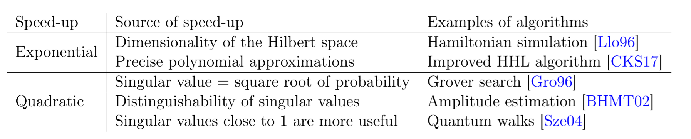

# [Quantum singular value transformation and beyond: exponential improvements for quantum matrix arithmetics](https://arxiv.org/abs/1806.01838)

# Introduction

This paper is about a single quantum idea that we call _“singular value transformation”_ generalizing all the above mentioned techniques (Grover's, HHL, Quantum walks, quantum simulation) except for Quantum Fourier Transform and therefore, Shor's algorithm.

## Previous work:

The problem in quantum simulation fundamentally is to take an efficient description of a Hamiltonian $H$, an evolution time $t$, and an error tolerance $\epsilon$, and find a quantum operation $V$ such that
$$
||e^{-iHt} - V|| \le \epsilon
$$
while the implementation of $V$ should use as few resources as possible.

The previous methods used Trotter decomposition and linear combinations of unitaries.

An alternative strategy used ideas from quantum walks. (Details commented out below) \
Recently another approach, called qubitization, was introduced to transform 
the spectrum in a more efficient manner.
<!-- Asymptotically, this approach is perhaps the favored method for simulating time-independent Hamiltonians because it is capable of achieving near-optimal scaling with all relevant parameters. The main tool developed for this approach is a walk operator that has eigenvalues $e^{−i \arcsin(E_k/\alpha)}$ where $E_k$ is the $k$-th eigenvalue of $H$ and $\alpha$ is a normalizing parameter. While early work adjusted the spectrum recovering the desired eigenvalues $e^{−iE_k}$ by using phase estimation to
invert the $\arcsin$, subsequent work achieved better scaling using linear combination of quantum walk steps [BCK15]. -->

---

## Broad view of the results

The central object for this result is **projected unitary encoding**, which is defined as follows: 

Suppose that $\widetilde{\Pi}$,$\Pi$ are orthogonal projectors and $U$ is a unitary. \
then we say that the unitary $U$ and the projectors $\widetilde{\Pi}$, $\Pi$ form a projected unitary encoding of the operator 
$$
A:=\widetilde{\Pi} U \Pi
$$

We define singular value transformation by a polynomial $P \in \mathbb{C}[x]$ in the following way: \
If $P$ is an odd polynomial and $A = W \Sigma V^{\dagger}$ is a singular value decomposition (SVD), then 
$$
P^{(SV)}(A) := W P(\Sigma) V^{\dagger}
$$
where the polynomial $P$ is applied to the _diagonal_ entries of $\Sigma$. 

Our main result is that for any degree-$d$ odd polynomial $P ∈ \mathbb{R}[x]$, that is bounded by $1$ in absolute value on $[−1, 1]$, we can implement a unitary $U_{\Phi}$ with a simple circuit **using $U$ and its inverse** a total number of $d$ times such that

$$ 
A=\widetilde{\Pi} U \Pi \Longrightarrow P^{(SV)}(A) = \widetilde{\Pi} U_\Phi \Pi.
$$

We prove a similar result for even polynomials as well, but with replacing $\widetilde{\Pi}$ by $\Pi$ in the above equation, and defining $P^{(SV)}(A) := V P(\Sigma) V^\dagger$ for even polynomials.

---

## Examples

In order to illustrate the power of this technique we briefly explain some corollaries of this result. 

### Example 1

For example suppose that $U$ is a quantum algorithm that on the initial state $\ket{0}^{\otimes n}$ succeeds with probability at least $p$, and indicates success by setting the first qubit to $\ket{1}$. 

Then we can take $\widetilde{\Pi}:=\ket{1} \bra{1} \otimes I_{n-1}$ and $\Pi := \ket{0} \bra{0}^{\otimes n}$. 

Observe that $A=\widetilde{\Pi} U \Pi$ is a rank-$1$ matrix having a single non-zero singular value being the square root of the success probability. 

If $P$ is an odd polynomial bounded by $1$ in absolute value such that $P$ is $\frac{\epsilon}{2}$-close to $1$ on the interval $[\sqrt{p}, 1]$, then by applying singular value transformation we get an algorithm $U_{\Phi}$ that succeeds with probability at least $1 - \epsilon$. 

Such a polynomial can be constructed with degree $\mathcal{O}\Big( \frac{1}{\sqrt{p}} \log(\frac{1}{\epsilon}) \Big)$ providing a conceptually simple and efficient implementation of fixed-point amplitude amplification.

### Example 2

It also becomes straightforward to implement the Moore-Penrose pseudoinverse directly. Suppose that $A = W \Sigma V^{\dagger}$ is an SVD, then the pseudoinverse is simply $A^{+} = V \Sigma^{-1} W^{\dagger}$, where we take the inverse of each non-zero diagonal element of $\Sigma$. If we have $A$ represented as a projected unitary encoding, then simply finding an appropriately scaled approximation polynomial of $\frac{1}{x}$ and applying singular value transformation to it implements an approximation of the Moore-Penrose pseudoinverse directly. 

### Example 3
As an application in quantum machine learning, we design a quantum algorithm for _principal component regression_, and argue that singular value transformation could become a central tool in designing quantum machine learning algorithms.

---

## General results and applications

Based on singular value transformation we develop two main general results: 
1. _Singular vector transformation_, which maps right singular vectors to left singular vectors, 2.
2. _Singular value threshold projectors_, which project out singular vectors with singular value below a certain threshold.
3. As a useful application of singular value threshold projectors we develop _singular value discrimination_, which decides whether a given quantum state has singular value below or above a certain threshold.
4. As another application we show that using singular vector transformation, one can efficiently implement a form of "non-commutative measurement" which is used for preparing ground states of local Hamiltonians. 
5. Also we propose a new method for _quantum singular value estimation_.

Other algorithms can also be cast in the singular value transformation framework, including optimal Hamiltonian simulation, robust oblivious amplitude amplification, fast $\mathsf{QMA}$ amplification, fast quantum OR lemma and certain quantum walk results. 
Based on these techniques we also show how to exponentially improve the complexity of implementing fractional queries to unitaries with a gapped spectrum. 

We summarize in the following table the various types of quantum speed-ups that are inherently incorporated in our singular value transformation framework. 

In order to harness the power of singular value transformation one needs to construct projected unitary encodings. A special case of projected unitary encoding is called _block-encoding_, when 

$$
\widetilde{\Pi} = \Pi = \ket{0} \bra{0}^{\otimes a} \otimes I
$$

In this case $A$ is literally the top-left block of the unitary $U$. In the paper we provide a versatile toolbox for efficiently constructing block-encodings, summarizing recent developments in the field. In particular we demonstrate how to construct block-encodings of unitary matrices, density operators, POVM operators, sparse-access matrices and matrices stored in a QROM. [By QROM we mean quantum read-only memory, which stores classical data that can be accessed in superposition.]

Furthermore, we show how to form linear combinations and products of block-encodings. 

# Preliminaries and notation

## Singular value decomposition

It is well known that for every $A \in \mathbb{C}^{m \times n}$ matrix, there exists a pair of unitaries $W \in \mathbb{C}^{m \times m}$, $V \in \mathbb{C}^{n \times n}$ and $\Sigma \in \mathbb{R}^{m \times n}$ such that $\Sigma$ is a diagonal matrix with non-negative non-increasing entries on the diagonal, and $A = W \Sigma V^{\dagger}$. 

Such a decomposition is called _singular value decomposition_. 

Let $k := \min[m, n]$, then we use $\varsigma_i := \Sigma_{ii}$ for $i \in [k]$ to denote the _singular values_ of $A$, which are the diagonal elements of $\Sigma$. 

The columns of $V$ are called right singular vectors, and the columns of $W$ are called the left singular vectors. 

In this paper we often define the matrix $A$ as the product of two orthogonal projectors $\widetilde{\Pi}, \Pi$ and unitary $U$ such that $A = \widetilde{\Pi} U \Pi$. In such a case we will assume without loss of generality that the first $rank(\widetilde{\Pi})$ left singular vectors span $img(\widetilde{\Pi})$ and the first $rank(\Pi)$ right singular vectors span $img(\Pi)$. 

(Where $[k]$ denotes the set $\{1, 2, \ldots, k\}$.)

The singular value decomposition is not unique if there are multiple singular values with the same value. However, the singular value projectors are uniquely determined.

## Singular value projectors

Let $A = W \Sigma V^{\dagger}$ be a singular value decomposition. 

Let $\Sigma_{\varsigma}$ be the matrix that we get from $\Sigma$ by replacing all singular values that have value $= \varsigma$ by $1$ and replacing all $\neq \varsigma$ singular values by $0$. 

Then we define the right singular value projector to singular value $\varsigma$ as $V \Sigma_{\varsigma} V^\dagger$, and define the left singular value projector to singular value $\varsigma$ as $W \Sigma_{\varsigma} W^\dagger$ projecting orthogonally to the subspace spanned by the corresponding singular vectors. 

For a set $S \subset \mathbb{R}$ we similarly define the right and left singular value projectors $V \Sigma_{S} V^\dagger$, $W \Sigma_{S} W^{\dagger}$ projecting orthogonally to the subspace spanned by the singular vectors having singular value in $S$.

## Polynomial approximations

In this paper we will work with polynomial approximations, and therefore we introduce some related notation. 

For a function $f : I \rightarrow \mathbb{C}$ and a subset $I' \subseteq I$ we use the notation $||f||_{I'}:=\sup_{x\in I'}|f(x)|$ to denote the sup-norm of the function $f$ on the domain $I'$. 

We say that a function $f \colon \mathbb{R} \rightarrow \mathbb{C}$ _is even_ if for all $x \in \mathbb{R}$ we have $f(-x) = f(x)$, and that it _is odd_ if for all $x\in\mathbb{R}$ we have $f(-x) = -f(x)$.

Let $P\in \mathbb{C}[x]$ be a complex polynomial $P(x) = \sum_{j=0}^{k} a_{j} x^{j}$, then we denote by $P^*(x) := \sum_{j=0}^{k} a^{*}_{j} x^{j}$ the polynomial with conjugated coefficients, and let $\Re[P](x) := \sum_{j=0}^{k} \Re[a_j] x^{j}$ denote the real polynomial we get by taking the real part of the coefficients. 

We say that $P$ _is even_ if all coefficients corresponding to odd powers of $x$ are $0$, and similarly we say that $P$ _is odd_ if all coefficients corresponding to even powers of $x$ are $0$. For an integer number $z \in \mathbb{Z}$ we say that $P$ has parity $z$ if $z$ is even and $P$ is even or $z$ is odd and $P$ is odd. 

We will denote by $T_{d} \in \mathbb{R}[x]$ the $d$-th Chebyshev polynomial of the first kind, defined by $T_d(x) := \cos(d \arccos(x))$

Whenever we present a matrix and put a $.$ in some place we mean a matrix with arbitrary values of the elements in the unspecified block. For example $[.]$ just denotes a matrix with completely arbitrary elements, similarly 
$$
U = 
\begin{bmatrix} 
A & . \\ 
. & . 
\end{bmatrix}
$$
denotes an arbitrary matrix whose top-left block is $A$.

For an orthogonal projector $\Pi$ we will frequently use the $\Pi$-controlled NOT gate, denoted by $C_{\Pi} NOT$, which implements a coherent measurement operator by flipping the value of a qubit based on whether the state of a register is in the image of $\Pi$ or not. For example if $\Pi=\ket{1} \bra{1}$, then we just get back the usual CNOT gate controlled by the second qubit.

## $C_{\Pi} NOT$ gate
For an orthogonal projector $\Pi$ let us define the $\Pi$-controlled NOT gate as the unitary operator

$$
\mathrm{C}_\Pi \mathrm{NOT} := X \otimes \Pi + I \otimes (I - \Pi)
$$