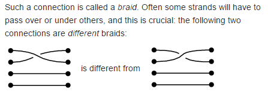
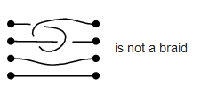

Even though braids look very similar to permutations, they have a slight difference which makes them not the same thing.

From this [Stack exchange answer](https://math.stackexchange.com/a/1474112):

As the term suggests, braids are made up of strings braided together. (Some authors depict them horizontally as above, other authors depict them vertically.) Every braid induces a permutation of the strings' left endpoints - just look at where they wind up on the right. And this is in fact homomorphic, so there is a surjection $B_{n} \mapsto S_{n}$. \
But different braids can induce the same permutation. Above, two distinct braids (in fact, these two braids are inverses of each other) induce the same permutation, which is a transposition of the top two dots.

Moreover, if you take one of those braids above and take positive integer powers of it, you will just keep twisting the first two strings around more and more without ever getting back the identity braid! In other words, they have infinite order, so in particular $B_n$
is infinite. Indeed, braid groups are torsionfree. Also unlike symmetric groups ( $n > 2$ ), Braid groups have nontrivial centers, which is always the infinite cyclic subgroup generated by a "full twist."

(Also, "permutation group" refers to any subgroup of a symmetric group.)

---

From wikipedia:

All strands are required to move from left to right; knots like the following are not considered braids:

