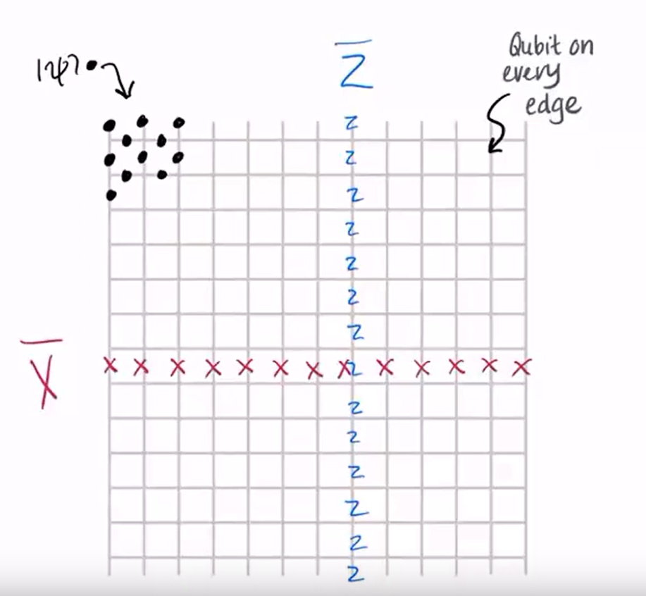

From: https://www.youtube.com/watch?v=BSZsH4dBBbc&t=2361s

A quantum code $\ket{\psi} \rightarrow \ket{\bar{\psi}}$ which is a static memory representing the original state isn't enough, we also need to have a Fault-tolerant channel which maps $H \ket{\psi} \rightarrow ?$ to have dynamic logic in there as well.

## Surface Code

This is the code that's most likely to be in the first generation of Quantum Computers, the reason for that is that:
1. It has a particularly high threshold against errors
2. It's pretty practical because you can easily emebed it into a $2d$ lattice of qubits. 

Below is the outline of the surface code:

In this schema, $1$ logical qubit is encoded into this $2d$ lattice of qubits.

This version of the grid, with boundaries at the start and stop is called the __planar__ code, and if we connect the top to bottom and left to right, we get the __toric__ code (Be ause our surface will be a torus). You might also have a torus with $2$ holes in it, whiuch could represent a different number of logical qubits.

In this $2$d lattice, every edge is a qubit, the $\bar{Z}$ operator is a column of $Z$ operators being applied to the qubits in the column, and the $\bar{X}$ operator is a row of $X$ operators being applied to the qubits in the row.

We see that each row and each column only have $1$ point (qubit) of interaction, so when we apply a $\bar{X} \bar{Z}$ operator to the lattice, every $Z$ and every $X$ operator will overlap with an $I$ operator, except for the $XZ$ and $ZX$ operators at the point of interaction. \
And since we know that $XZ = -ZX$, we can say that this identity is preserved for the $\bar{X}$ and $\bar{Z}$ operators as well. $\bar{X}\bar{Z} = - \bar{Z}\bar{X}$ \
(The only $-1$ factor comes from the point of interaction)

As we see in the below figure, we can take __any__ string of $Z$'s that goes from top to bottom which overlaps with a __particular__ $\bar{X}$ operator at only one location as a $\bar{Z}$ operator. 

So we see that there's a whole set of different logical operators that all have the right properties so this system has redundancy. 

The same goes for the $X$ operator, note that the only restriction here is that it should have only $1$ interaction with each $Z$ in the system. As seen below: 

(Notice that the $Z$ operators are on the lines of the grid while the $X$ operators are going _through_ the lines which is how it's supposed to be to get the anti-commutation property)

Because of the "wiggly" shape that these operators can take, we call them __topologically non-trivial__ operators.

### Stabilizers of the Surface Code

Another property of the Pauli operators (which we want to preserve in this code and its operators) is that their squares are $I$ operators. \
i.e. $Z^2 = I$, $Z^2 \ket{\psi} = \ket{\psi}$.

So let's see how this works out in this surface code.

If we apply two strings of $Z$ operators on the __same__ path, they will cancel out and give a $\bar{I}$ operator for the system.

But what if we apply two strings of $Z$ operators on __different__ paths? (like the $\bar{Z_1}, \bar{Z_2}$ operators in the right part of the figure)

We see that obviously $\bar{Z_1} \bar{Z_2} \neq \bar{I}$.

But since this code is correct (TODO: proof?), we know that the second form of the property is preserved:

$$
\bar{Z_1}\bar{Z_2} \ket{\bar{\psi}} = \ket{\bar{\psi}}
$$

Meaning that after applying the $\bar{Z_1}$ and $\bar{Z_2}$ operators, the state represented by the code is still the same.

This means that the operators that don't trivially cancel each other out (as seen in the orange section of below figure):

This loop, which we'll call $S$ has to have a trivial action of the state and it is called a __stabilizer__ of the surface code.

$$
S \ket{\bar{\psi}} = \ket{\bar{\psi}}
$$

Going through a bunch of different examples, we can see that these operators always form _loops_ in the grid, and these operators in one grid form a __stabilizer group__. \
These groups are generated by the smallest possible loops which are called plaquette operators. 

The smallest possible square on the left is called a _plaquette_ and the operators that go through it are called _plaquette operators_. \

[Stopped at 39:20]