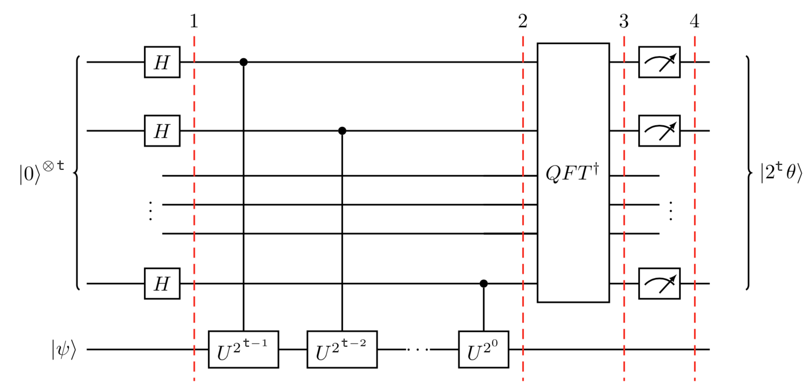
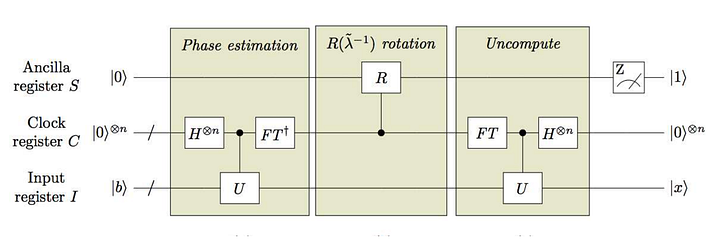

# Explanation of the HHL Algorithm

## Introduction

The problem we're trying to solve here has to do with systems of linear equations, in other words:

$$
Ax = b
$$

In our treatment, we're only considering cases where the $A$ is a Hermitian matrix, which means we can write $A$ in terms of its eigenvalues and eigenvectors:

$$
A = \sum_{j=0}^{N_1} \lambda_j \ket{u_j}\bra{u_j}
$$

This means that we can write the inverse of $A$ as:

$$
A^{-1} = \sum_{j=0}^{N_1} \lambda_j^{-1} \ket{u_j}\bra{u_j}
$$

We can easily check that this is indeed the inverse of $A$:

$$
\begin{align*} 
AA^{-1} 
&= \sum_{j=0}^{N_1} \lambda_j \ket{u_j}\bra{u_j} \sum_{i=0}^{N_1} \lambda_i^{-1} \ket{u_i}\bra{u_i} \\
&= \sum_{j=0}^{N_1} \sum_{i=0}^{N_1} \lambda_j \lambda_i^{-1} \ket{u_j} \braket{u_j | u_i} \bra{u_i} \\
&= \sum_{j=0}^{N_1} \sum_{i=0}^{N_1} \lambda_j \lambda_i^{-1} \ket{u_j} \delta_{ij} \bra{u_j} \\
&= \sum_{j=0}^{N_1} \lambda_j \lambda_j^{-1} \ket{u_j}\bra{u_j} \\
&= \sum_{j=0}^{N_1} \ket{u_j}\bra{u_j} \\
&= I
\end{align*}
$$

Since $A$'s eigenvectors make up a complete and orthonormal basis, we can write $b$ as:

$$
\ket{b} = \sum_{j=0}^{N_1} b_j \ket{u_j}, \quad b_j \in \mathbb{C}
$$

The main goal of HHL is to solve this system of linear equations, or in QC terms, get a register in the state:

$$
\ket{x} = A^{-1} \ket{b} = \sum_{j=0}^{N_1} \lambda_j^{-1} b_j \ket{u_j}
$$

### Some conditions

In HHL, the matrix $A$ does not need to be Hermitian, but when it is not, we must transform it into a Hermitian matrix. We do this by converting $A$ into the following:

$$
A' = \begin{pmatrix} 0 & A \\ A^{\dagger} & 0 \end{pmatrix}
$$

Which we will use to solve the system. \
However, $A$ must be _sparse_ and _well-conditioned_.

A matrix is **s-sparse** when it has at most $s$ non-zero elements per any row or column; and a matrix is **sparse** if it has at most $poly(\log(N))$ entires in any row or column. 

The condition number $\kappa$ of a Hermitian matrix is the ratio of the largest to smallest eigenvalue magnitude and is undefined when the smallest eigenvalue magnitude is $0$.

---

### Sidenote: What is a condition number?

In numerical analysis, the condition number of a function measures how much the output value of the function can change for a small change in the input argument.

A problem with a low condition number is said to be well-conditioned, while a problem with a high condition number is said to be ill-conditioned.

### Side-note: What are singular values?

Let $A$ be an $m \times n$ matrix. \
Now consider the matrix $A^TA$. This is a symmetric $n \times n$ matrix, so its eigenvalues are real and non-negative. 

__Proof of non-negativity:__ \
Let $x$ be an eigenvector of $A^TA$ with eigenvalue $\lambda$. Then we compute that:

$$
\begin{align*} 
||Ax||^2 
&= (Ax) \cdot (Ax) \\
&= (Ax)^{T} Ax \\
&= x^{T} A^{T} A x \\
&= x^{T} (\lambda x) \\
&= \lambda ||x||^2 
\end{align*}
$$

Since $||Ax||^2 \geq 0$, we have from the above equation that $\lambda ||x|| \geq 0$. Since we've assumed that our eigenvalues are not zero, we have $||x||^2 \geq 0$, which means that $\lambda \geq 0$.

Now, let $\lambda_1, \dots, \lambda_n$ denote the eigenvalues of $A^TA$, we order these such that $\lambda_1 \geq \dots \geq \lambda_n \geq 0$. Let $\sigma_i = \sqrt{\lambda_i}$, so that $\sigma_1 \geq \dots \geq \sigma_n \geq 0$. 

Then we call the $\sigma_i$ the singular values of $A$.

---

### Sidenote: Quantum Phase Estimation

Given a unitary operator U, QPE estimates $\theta$ in $U\ket{\psi} = e^{2\pi i \theta} \ket{\psi}$. Here $\ket{\psi}$ is an eigenvector and $e^{2\pi i \theta}$ is the corresponding eigenvalue. Since $U$ is unitary, all of its eigenvalues have a norm of $1$.

This is the outline of the circuit:

The top register contains $t$ 'counting' qubits, and the bottom contains qubits in the state $\ket{\psi}$.

The quantum phase estimation algorithm uses phase kickback to write the phase of U (in the Fourier basis) to the t qubits in the counting register.

The states evolve like this:

1. Setup:
$$
|\psi_0\rangle = \lvert 0 \rangle^{\otimes n} \lvert \psi \rangle
$$

2. Superposition:
$$
|\psi_1\rangle = {\frac {1}{2^{\frac {n}{2}}}}\left(|0\rangle +|1\rangle \right)^{\otimes n} \lvert \psi \rangle
$$
3. Controlled Unitary Operations:
Since $U$ is a unitary operator with eigenvector $\ket{\psi}$ such that $U\ket{\psi} = e^{2\pi i \theta} \ket{\psi}$, this means:
$$
U^{2^{j}}|\psi \rangle =U^{2^{j}-1}U|\psi \rangle =U^{2^{j}-1}e^{2\pi i\theta }|\psi \rangle =\cdots =e^{2\pi i2^{j}\theta }|\psi \rangle
$$

So, applying all the $n$ controlled operations $CU^{2^j}$ with $0 \leq j \leq n−1$, and using the relation:

$$
|0\rangle \otimes |\psi \rangle +|1\rangle \otimes e^{2\pi i\theta }|\psi \rangle =\left(|0\rangle +e^{2\pi i\theta }|1\rangle \right)\otimes |\psi \rangle
$$

We get:

$$
|\psi_{2}\rangle = \frac {1}{2^{\frac {n}{2}}} \left(|0\rangle+{e^{\boldsymbol{2\pi i} \theta 2^{n-1}}}|1\rangle \right) \otimes \cdots \otimes \left(|0\rangle+{e^{\boldsymbol{2\pi i} \theta 2^{1}}}\vert1\rangle \right) \otimes \left(|0\rangle+{e^{\boldsymbol{2\pi i} \theta 2^{0}}}\vert1\rangle \right) \otimes |\psi\rangle
$$

Recall that QFT maps an $n$-qubit input state $\ket{x}$ into an output as:
$$
QFT\vert x \rangle = \frac{1}{2^\frac{n}{2}}
\left(\vert0\rangle + e^{\frac{2\pi i}{2}x} \vert1\rangle\right) 
\otimes
\left(\vert0\rangle + e^{\frac{2\pi i}{2^2}x} \vert1\rangle\right) 
\otimes  
\ldots
\otimes
\left(\vert0\rangle + e^{\frac{2\pi i}{2^{n-1}}x} \vert1\rangle\right) 
\otimes
\left(\vert0\rangle + e^{\frac{2\pi i}{2^n}x} \vert1\rangle\right)
$$

Replacing $x$ by $2^n \theta$ in the above expression gives exactly the expression derived in step 2 above. Therefore, to recover the state $\ket{2^n \theta}$, we apply an inverse Fourier transform on the auxiliary register to get $\ket{2^n \theta}$.

4. Measurement:
The above expression peaks near $x=2^n \theta$. For the case when $2^n \theta$ is an integer, measuring in the computational basis gives the phase in the auxiliary register with high probability:

$$
|\psi_4\rangle = | 2^n \theta \rangle \otimes | \psi \rangle
$$

For the case when $2^n \theta$ is not an integer, it can be shown that the above expression still peaks near $x=2^n \theta$ with probability better than $\frac{4}{\pi^2} \approx 40\%$

---

## The HHL Algorithm

At a very high level, this algorithm has three big steps to do its job:
1. Phase estimation
2. Eigenvalue inversion rotation
3. Inverse Phase estimation

We start with three registers, an ancilla register $S$, a clock register $C$ and an input register $I$.

The procedure of this algorithm is as follows:

0. State preparation: We prepare the ancilla and clock registers in the state $\ket{0}$ and the input register in the state $\ket{b}$, like the following:

$$
\vec{b}=
\begin{pmatrix}
\beta_0 \\
\beta_1 \\
\vdots \\
\beta_{N_b-1} \\
\end{pmatrix}
\Leftrightarrow
\beta_0\ket{0}+\beta_1\ket{1}+\cdots+\beta_{N_b -1}\ket{N_b -1}=\ket{b}
$$
(Omitting the normalization factor)

But we also know that $\ket{b}$ can be written in terms of the eigenvectors of $A$ as:

$$
\ket{b} = \sum_{j=0}^{N_b - 1} b_j \ket{u_j}
$$

So our total initial state is:

$$
\ket{\psi_0} = \ket{b}_{N_b} \ket{0}_{N_l} \ket{0}_a
$$

1. Apply Quantum Phase Estimation (QPE) with:

$$
U = e^{iAt} = \sum_{j=0}^{N_b - 1} e^{i\lambda_j t} \ket{u_j}\bra{u_j}
$$

(We can do this because $A$ is Hermitian)

Now, remembering that the phases go on the clock qubits and the $\ket{b}$'s state stays the same, \
The entire quantum register after the QPE, expressed in the eigenbasis of $A$, is:

$$
\sum_{j=0}^{N_b - 1} b_j \ket{u_j}_{N_b} \ket{2^{N_l} \lambda_j t / 2\pi}_{N_l} \ket{0}_a
$$

Where $N_l$ is the number of qubits in the clock register and $N_b$ is the number of qubits in the input register.

Note that $\lambda_j$ are usually not integers. We will choose $t$ so that $\tilde{\lambda_j}=2^{N_l}\lambda_j t/2\pi$ are integers. Therefore, the encoded values $\tilde{\lambda_j}$ is usually different from $\lambda_j$ but its scaled version. 

So our state can be rewritten as

$$
\sum_{j=0}^{2^{n_b}-1} b_j \ket {u_j} \ket{\tilde{\lambda_j}} \ket{0}_a
$$

2. Apply a controlled rotation on the ancilla qubit to get a normalized state of the form:

$$
\sum_{j=0}^{N-1} b_j \ket{u_j} \ket{\tilde{\lambda_j}} \Big( \sqrt{1 - \frac{C^2}{\tilde{\lambda_j}^2}} \ket{0}_a + \frac{C}{\tilde{\lambda_j}} \ket{1}_a \Big)
$$

These rotations are conditioned on each eigenvalue of $A$, and they can be achieved by the application of the $R_Y$ rotation matrix where

$$
\theta_j = 2\cos^{-1}(\frac{C}{\tilde{\lambda_j}})
$$

Note also that $C$ here is a scaling factor we use to make sure that all of our quantum states are normalized.

3. The final step of the algorithm is to perform inverse quantum phase estimation. This sets the clock register back to 0’s and leaves the remaining state as

$$
\sum_{j=0}^{N-1} b_j \ket{u_j} \ket{0^{\otimes N_l}} \Big( \sqrt{1 - \frac{C^2}{\tilde{\lambda_j}^2}} \ket{0}_a + \frac{C}{\tilde{\lambda_j}} \ket{1}_a \Big)
$$

Notice that if the ancilla qubit is $1$, then the state of the registers is a normalized equivalent of the solution vector. 

4. So we measure this ancilla qubit, and if we do get $1$, the new state indeed is:

$$
\sqrt{\frac{1}{\sum_{j=0}^{N-1} |b_j|^2 / |\lambda_j|^2 }} \times \sum_{j=0}^{N-1} \frac{b_j}{\lambda_j} \ket{u_j} \ket{0^{\otimes N_l}}
$$

In which now the $\ket{b}$ register is component-wise proportional to the solution vector $\ket{x}$ ($\frac{b_j}{\lambda_j} \ket{u_j}$).

Note: At the end, we have to make sure to consider them in the computational basis, and not the eigenbasis of $A$.

---

References:
1. https://medium.com/mit-6-s089-intro-to-quantum-computing/hhl-solving-linear-systems-of-equations-with-quantum-computing-efb07eb32f74
2. https://arxiv.org/abs/2108.09004
3. https://qiskit.org/textbook/ch-algorithms/quantum-phase-estimation.html#getting_more_precision