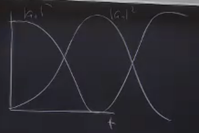

# Lecture 1

## What we're doing in this class

Information is physical, ergo, manipulating physical systems is doing computation.

Classic Turing Machine: A machine that can be programmed to do any computation.                                                                                                                                                                                                  
There are two ways of doing quantum mechanics, either using linear algebra or wave functions, Jens' class will focus on the former while this class will focus on the latter.

---

## What is a qubit?

A classical bit is either 0 or 1, a quantum bit is quantum state that is a superposition of $|0\rangle$ and $|1\rangle$.

---

## The Schrödinger Equation

The Schrödinger's equation is the wave equation for a quantum system. It is a second order differential equation that describes the evolution of a quantum system and is given by:

$$
i\hbar\frac{\partial}{\partial t}\Psi(\vec{x},t) = \hat{H}(\vec{x}, t)\Psi(\vec{x},t)
$$

where $\Psi(x,t)$ is the wave function, $\hat{H}$ is the Hamiltonian, and $i$ is the imaginary unit.

Usually, in a quantum mechanics class we say that even though the wavefunction is a function of space and time, we can separate the two and write the wavefunction as $\Psi(\vec{x}, t) = \psi(\vec{x})\phi(t)$.

We then plug this into the Schrodinger's equation, separate the variables, and solve for $\psi(\vec{x})$ and $\phi(t)$ to get:

$$
i \hbar \frac{\partial \phi(t)}{\partial t} = E \phi(t)
$$
$$
\Rightarrow \phi(t) = e^{-iEt/\hbar}
$$

And

$$
H \psi_n(\vec{x}) = E_n \psi(\vec{x}) \\
$$

We just need to know the hamiltonian to find the position-depdent wavefunction and what we'll see is that the wavefunctions are quantized and each of them have a specific energy.

So, how do quantum bits arise from this equation? Well, that's exactly what we'll see in the next section.

---

## From Griffiths to Vector Spaces

To get there, let's first solve the Schrodinger equation for a particle in a box (infinite square well) which is a 1D problem. The Hamiltonian for this system is:

$$
\hat{H} = \frac{\hat{p}^2}{2m} + V(\vec{x})
$$

Where

$$
V(\vec{x}) = \begin{cases}
0 & \text{if } 0 \leq x \leq L \\
\infty & \text{otherwise}
\end{cases}
$$

Putting this into the Schrodinger equation, we get:

$$
\big( - \frac{\hbar^2}{2m} \frac{\partial^2}{\partial x^2} + V(x) \big) \psi(x) = E_n \psi(x)
$$

Since our potential is a piecewise function, our solution will be a piecewise function as well. \
For inside the box, we have:

$$
- \frac{\hbar^2}{2m} \frac{\partial^2}{\partial x^2} \psi(x) = E_n \psi(x) \\
\, \\
\text{Setting } k^2 = \frac{2mE}{\hbar^2}, \\
\, \\
\Rightarrow \frac{d^2 \psi}{dx^2} = -(\frac{2mE}{\hbar^2}) \psi(x) = -k^2 \psi(x) \\
\, \\
\Rightarrow \psi(x) = A \sin(kx) + B \cos(kx)
$$

Because the potential at the edges is infinite, the wavefunction at the edges is 0. \
We use this as a boundary condition and get:

$$
\psi(0) = 0 = A \\
\, \\
\Rightarrow \psi(x) = B \sin(kx)
$$

And,

$$
\psi(L) = 0 = B sin(kL) \\
\, \\
\Rightarrow kL = n\pi \\
\, \\
\rightarrow k = \frac{n\pi}{L}
$$

Therefore our wavefunction is:
$$
\psi(x) = \begin{cases}
0 & \text{if } x < 0 \\
B \sin(\frac{n\pi}{L}x) & \text{if } 0 \leq x \leq L \quad \text{ for } n= 1, 2, \dots \\
0 & \text{if } x > L
\end{cases}
$$

Any $n$ is a solution, and any linear combination of these solutions is also a solution because the Schrodinger equation is linear. 

Now, how do we find $B$?
Since we know that the particle has to be somewhere in the box, and knowing that $|\psi(x)|^2$ at any point $x$ gives us the probability of the particle being in that particular $x$, we can integrate the wavefunction over the entire box and get:

$$
\int |\psi(x)|^2 dx = \int_0^L dx \, B^2 \sin^2(\frac{n\pi}{L}x) \stackrel{\text{wave of hand}}{=} \frac{L}{2} B^2 = 1 \\
\, \\
\Rightarrow B = \sqrt{\frac{2}{L}} \\
\, \\
\Rightarrow \psi(x) = \sqrt{\frac{2}{L}} \sin(\frac{n\pi}{L}x)
$$

And now we can get the energy of the eigenstates ($\psi_n$'s) by using the formula for $k$:

$$
E_n = \frac{\hbar^2 k^2}{2m} = \frac{\hbar^2 \pi^2}{2mL^2} n^2
$$

And our solutions are standing waves, where the first solutions fits $\frac{1}{2}$ the wavelength in the box, the second fits $1$ whole wavelength, the third fits $\frac{3}{2}$ wavelengths, and so on.

Now, let's introduce perturbation theory into this, and change the potential such that $V \rightarrow V + V'$ with

$$
V'(x) = \Omega \cos(\frac{\pi x}{L})
$$

Graphing this $V'$ over $L$, we see that it kinda tilts the total potential $V$ down with a partial cosine wave.

Now, what will our new solutions be? If $\Omega$ is small, meaning that $\Omega >> \Delta E$, we can assume that our new solutions will be very similar to our old ones, but with a time dependence. So, we can write our new solutions as:

$$
\Psi'(\vec{x}, t) = \sum_{n=0}^{\infty} a_n(t) \psi_n(\vec{x}) e^{-i E_n t/\hbar}
$$

(Remember, our set of time-independent solutions, $\psi_n$'s are complete, meaning that they span the entire space of solutions, so we can write any solution as a linear combination of them by using Fourier sums.)

Now we want to find the coefficients $a_n(t)$, so we plug this into the Schrodinger equation and get:

$$
H' \Psi'(\vec{x}, t) = i \hbar \frac{d}{dt} \Psi'(\vec{x}, t) \\

\big( - \frac{\hbar^2}{2m} \frac{\partial^2}{\partial x^2} + V' \big) \sum_{n=0}^{\infty} a_n(t) \psi_n(x) e^{-i E_n t/\hbar} = i \hbar \frac{d}{dt} \big( \sum_{n=0}^{\infty} a_n(t) \psi_n(x) e^{-i E_n t/\hbar} \big) \\
 
\Rightarrow \sum_{n=0}^{\infty} a_n(t) E_n \psi_n(x) e^{-i E_n t/\hbar} + V'(x) \big( \sum_{n=0}^{\infty} a_n(t) \psi_n(x) e^{-i E_n t/\hbar} \big) = \\ 
i \hbar \sum_{n=0}^{\infty} \dot{a}_n(t) \psi_n(x) e^{-i E_n t/\hbar} + \sum_{n=0}^{\infty} E_n a_n(t) \psi_n(x) e^{-i E_n t/\hbar} \\

\Rightarrow V'(x) \big( \sum_{n=0}^{\infty} a_n(t) \psi_n(x) e^{-i E_n t/\hbar} \big) = i \hbar \sum_{n=0}^{\infty} \dot{a}_n(t) \psi_n(x) e^{-i E_n t/\hbar}
$$

Now, knowing the orthogonality of the eigenfunctions, we get to using Fourier's trick. \
By denoting that:

$$
\int_{-\infty}^{\infty} \psi_n(x) \psi^{*}_m(x) dx = \delta_{nm}
$$

We multiply from the left by $\psi^{*}_m(x) \, e^{i E_m t / \hbar}$ and integrate over the entire box:

$$
\int_{0}^{L} dx \, \psi^{*}_m(x) \, e^{i E_m t / \hbar} \, V'(x) \big( \sum_{n=0}^{\infty} a_n(t) \psi_n(x) e^{-i E_n t/\hbar} \big) \\ 
= \int_{0}^{L} dx \, \psi^{*}_m(x) \, e^{i E_m t / \hbar} \big(  i \hbar \sum_{n=0}^{\infty} \dot{a}_n(t) \psi_n(x) e^{-i E_n t/\hbar} \big) \\
\Rightarrow \sum_{n=0}^{\infty} \int_{0}^{L} dx \, \psi^{*}_m(x) \, e^{i E_m t / \hbar} \, V'(x) a_n(t) \psi_n(x) e^{-i E_n t/\hbar} = i \hbar \dot{a}_m \\
\, \\
\Rightarrow \sum_{n=0}^{\infty} \int_{0}^{L} dx \, \psi^{*}_m(x) \, e^{i E_m t / \hbar} \big( \Omega \cos(\frac{\pi x}{L}) \big) \, a_n(t) \psi_n(x) e^{-i E_n t/\hbar} = i \hbar \dot{a}_m
$$

(On the LHS of the final line, we notice that there is a $V'(x)$ term coming between the $\psi^{*}_m$ and $\psi_n$, so we can't simplify it like we did on the RHS.)

Now, for the LHS, we can calculate the result of this particular integral:

$$
\int_{0}^{L} \psi^{*}_m(x) \cos(\frac{\pi x }{L}) \psi_n(x) dx = \begin{cases}
\frac{1}{2} & \text{if } m = n \pm 1 \\
0 & \text{otherwise}
\end{cases}
$$

So this leaves two terms in our previous LHS integral:

$$
\frac{\Omega}{2} \big(a_{m+1} e^{-i (E_{m+1} - E_m) t/\hbar )} + a_{m-1} e^{-i (E_{m-1} - E_m) t/\hbar )} \big) = i\hbar \dot{a}_m
$$

Now let's for every $m$, rewrite $\frac{1}{\hbar } (E_{m+1} - E_m) = \omega_m$, which is the energy difference (transition frequency) between the $m$-th and $(m+1)$-th energy levels.

$$
\frac{\Omega}{2} \big(a_{m+1} e^{-i \omega_m t )} + a_{m-1} e^{+i \omega_{m-1} t )} \big) = i\hbar \dot{a}_m
$$

If we try to write all terms rising from the above formula, we get a pattern:

$$
\frac{\Omega}{2} (a_{2} e^{-i \omega_1 t}) = i\hbar \dot{a}_1 \\
\, \\
\frac{\Omega}{2} (a_{3} e^{-i \omega_2 t} + \big[ a_{1} e^{+i \omega_1 t}\big] ) = i\hbar \dot{a}_2 \\
\, \\
\frac{\Omega}{2} (a_{4} e^{-i \omega_3 t} + a_{2} e^{+i \omega_2 t}) = i\hbar \dot{a}_3 \\
\vdots
$$

If at $t=0$, we have $a_1 = 1, a_{m \neq 1} = 0$, (1-indexed) the only non-zero term on the RHS's will be $\big[ \frac{\Omega}{2} a_{1} e^{+i \omega_1 t} = i\hbar \dot{a}_2 \big]$ term.

Doing a very short time analysis ($t$ slightly after $0$) on that line of math, only $\dot{a}_2 > 0$; therefore the value of $a_2$ will start to grow, meaning that the "population" will start to shift from $\psi_1$ to $\psi_2$.  \
How fast this transition will happen is determined by the $\Omega$ factor, which is the "strength" of this perturbation.
- If $\Omega < \omega$, before $a_2$ grows very much, the $[e^{+i \omega_1 t}]$ term will flip sign and population starts moving back to $\psi_1$; so not much happens.
- If $\Omega >> \omega$, all sorts of crazy things happen and we'd have to think about many orders of this and at some point we reach a point where these energy separations are bigger than $\Omega$ ($\omega > \Omega$) and then we can stop solving these equations numerically.

But this is not the case that we want to treat! What we want is actually slightly different than this one, because we were thinking about the $\Omega < \omega$ case which is boring and not much happens in that case.

But we can make it non-boring! Let's change $V'$ to something time-dependent at exactly the same frequency as the energy difference between the first two levels.

$$
V'(x) = \big(\Omega \cos(\omega_1 t)\big) \cos(\frac{\pi x}{L})
$$

And as we know, we can rewrite the $\cos(\omega_1 t)$ term as:

$$
\cos(\omega_1 t) = \frac{1}{2} \big( e^{i \omega_1 t} + e^{-i \omega_1 t} \big)
$$

So we can now rewrite all of our terms in the LHS of the equation system as:

$$
\frac{\Omega}{2} \frac{1}{2} \big( e^{i \omega_1 t} + e^{-i \omega_1 t} \big) (a_{2} e^{-i \omega_1 t}) = i\hbar \dot{a}_1  \\
\, \\
\frac{\Omega}{2} \frac{1}{2} \big( e^{i \omega_1 t} + e^{-i \omega_1 t} \big) (a_{3} e^{-i \omega_2 t} +  a_{1} e^{+i \omega_1 t} ) = i\hbar \dot{a}_2 \\
\, \\
\frac{\Omega}{2} \frac{1}{2} \big( e^{i \omega_1 t} + e^{-i \omega_1 t} \big) (a_{4} e^{-i \omega_3 t} + a_{2} e^{+i \omega_2 t}) = i\hbar \dot{a}_3 \\
\vdots
$$ 

Expanding these, we get:

$$
i\hbar \dot{a}_1 = \frac{\Omega}{4} a_2 \big( 1 + e^{-2i \omega_1 t} \big)  \\
\, \\
i\hbar \dot{a}_2 = \frac{\Omega}{4} a_3 (e^{i \omega_1 t} + e^{-i \omega_1 t}) e^{-i \omega_2 t} + \frac{\Omega}{4} a_1 (1 + e^{2i \omega_1 t}) \\
\vdots
$$ 

When we go to solve these equations, we will see that all of the terms that have $e^{i \omega_1 t}$'s in them won't actually do much, because they oscillate back and forth between positive and negative really fast, so when integrating them nothing really accumulates. So we can ignore them. Now we write:

$$
i\hbar \dot{a}_1 = \frac{\Omega}{4} a_2  \\
\, \\
i\hbar \dot{a}_2 = \frac{\Omega}{4} a_1 \\
$$

This is something called the **Rotating Wave Approximation (RWA)**, which comes up frequently in quantum computing and we can use it to simplify our equations. We will deal with it formally later.

The two equations we got at last are two coupled differential equations; we can simply solve them by taking a derivative of one of them and putting it into the other one.

Doing all that jazz, we get:

$$
\ddot{a}_1 = (\frac{\Omega}{4\hbar}) a_1
\, \\
\, \\
\Rightarrow a_1 = A \cos(\frac{\Omega t}{4 \hbar}) + B \sin(\frac{\Omega t}{4 \hbar})
$$

And using the initial condiiton of $a_1(0) = 1$, we get:

$$
a_1(t) = \cos(\frac{\Omega t}{4 \hbar})
$$

Doing a similar calculation, we find that:

$$
a_2(t) = i \sin(\frac{\Omega t}{4 \hbar})
$$

With these initial conditions and $a_1$ and $a_2$, going back to the original equation, we can find the time-dependent wavefunction:

$$
\begin{align*}
\Psi'(x, t) &= \sum_{n=0}^{\infty} a_n(t) \psi_n(x) e^{-i E_n t/\hbar} \\
&= \cos(\frac{\Omega t}{4 \hbar}) \psi_1(x) e^{-i E_1 t / \hbar} + i \sin(\frac{\Omega t}{4 \hbar}) \psi_2(x) e^{-i E_2 t/\hbar}
\end{align*}
$$

So basically, from now on we can keep track of our system by only keeping track of $a_1$ and $a_2$. \
And if we plot the probability density of $\Psi'(x, t)$ by the way of $|a_1|^2$ and $|a_2|^2$, we get:

Now! In the general case, instead of keeping separate tabs of all of our $a_i$'s, we put them all in a vector and call it the **State Vector**. So we can write:

$$
\ket{\psi(t)} = \begin{pmatrix} a_1(t) \\ a_2(t) \\ \vdots \\ a_n(t) \end{pmatrix}
$$

In our case where we started with $a_1(0) = 1$, we only need to keep track of _two_ levels, so we write:

$$
\ket{\psi(t)} = \begin{pmatrix} a_1(t) \\ a_2(t) \end{pmatrix}
$$

And this is our first **Qubit**!