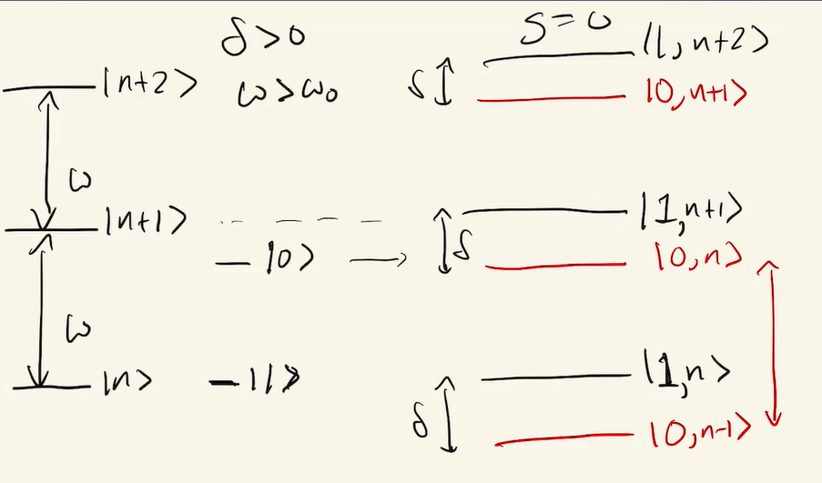
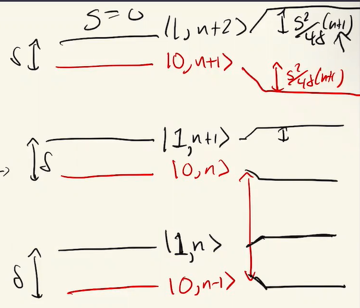
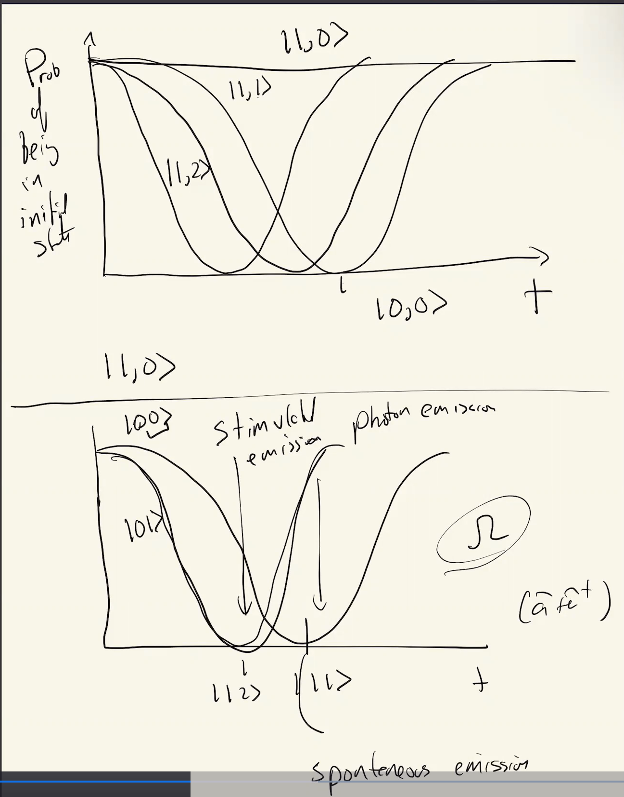

# Jaynes-Cummings Hamiltonian

## Matrix form

From the previous lecture, we recall that the   Jaynes-Cummings Hamiltonian is given by (omitting an $\hbar$ factor):

$$
H_{TOT} = \frac{\omega_0}{2} \hat{\sigma}_Z + \omega (\hat{a}^\dagger \hat{a} + \frac{1}{2}) + \frac{g}{2} (\hat{\sigma}^{+} \hat{a} + \hat{\sigma}^{-} \hat{a}^\dagger)
$$

Now, we want to find a way to write this hamiltonian in matrix form, but we already know that because of the QHO, it's infinite-dimensional, but there is a way to do it!

To do that, we need to analyze the behavior of this hamiltonian acting on our composite basis states, where our Hilbert space is:

$$
\mathcal{H} = \mathcal{H}_{Qubit} \otimes \mathcal{H}_{QHO}
$$

Applying the hamiltonian to the composite basis states and remembering that $|0\rangle$ is the excited state, we get:

$$
\begin{align*}
\hat{H} \ket{0, n} &= \big(\frac{\omega_0}{2} + \omega (n + \frac{1}{2}) + \frac{g}{2} \hat{\sigma}^{-} \hat{a}^\dagger \big) |0, n\rangle \\
&= \big(\frac{\omega_0}{2} + \omega (n + \frac{1}{2}) \big) |0, n \rangle + \frac{g}{2} \sqrt{n+1} |1, n+1 \rangle \\
\end{align*}
$$

So we see that the $\ket{0, n}$ state is actually only **coupled** to itself $\ket{0, n}$ and the state $\ket{1, n+1}$ which comes up after the qubit loses energy by emitting a photon. \
This is also the same the other way around, meaning that the $\ket{1, n+1}$ state is only **coupled** to itself and the state $\ket{0, n}$.

In our calculations, we will mostly assume that $\omega > \omega_0$ so that having one more photon has more energy than putting the qubit in the excited state. (so the photons can actually excite the qubit)

Therefore the general states with regards to this hamiltonian are:

$$
\ket{\psi} = a \ket{1, n+1} + b \ket{0, n} = \begin{pmatrix} a \\ b \end{pmatrix}
$$

So we see that our hilbert space is actually restricted to $2$ states only, therefore we can write our restricted hamiltonian as a $2\times 2$ matrix (omitting the $\hbar$ factor):

$$
\hat{H}_n = \begin{pmatrix} -\frac{\omega_0}{2} + \omega (n + 1 + \frac{1}{2}) & \frac{g}{2} \sqrt{n+1} \\ \frac{g}{2} \sqrt{n+1} & \frac{\omega_0}{2} + \omega (n + \frac{1}{2}) \end{pmatrix}
$$

Remember that in hamitlonian matrices, the off-diagonal terms are the coupling terms. Also, as we can see the hamiltonians for different $n$'s have different values, but the same structure.

So the hamiltonian for the whole (infinitedimesional) system is the following:

$$
\hat{H} = \begin{bmatrix}
\hat{H}_0 & 0 & 0 & \dots \\
0 & \hat{H}_1 & 0 & \dots \\
0 & 0 & \hat{H}_2 & \dots \\
\vdots & \vdots & \vdots & \ddots
\end{bmatrix}
$$

Which is what we call a block-diagonal matrix.

Now, lets simplify (?) the hamiltonian a bit.

$$
\begin{align*}
\hat{H}_n &=
\begin{pmatrix}
-\frac{\omega_0}{2} + \omega (n + 1 + \frac{1}{2}) & \frac{g}{2} \sqrt{n+1} \\
\frac{g}{2} \sqrt{n+1} & \frac{\omega_0}{2} + \omega (n + \frac{1}{2})
\end{pmatrix} \\
&= \begin{pmatrix}
(n+1) \omega & 0 \\
0 & (n+1) \omega \end{pmatrix} +
\begin{pmatrix}
-\frac{\omega_0}{2} + \frac{\omega}{2} & \frac{g}{2} \sqrt{n+1} \\
\frac{g}{2} \sqrt{n+1} & \frac{\omega_0}{2} - \frac{\omega}{2}
\end{pmatrix} \\
&\stackrel{\delta = \omega - \omega_0}{=} (n + 1) \omega \hat{I} + \begin{pmatrix}
\frac{\delta}{2} & \frac{g}{2} \sqrt{n+1} \\
\frac{g}{2} \sqrt{n+1} & -\frac{\delta}{2}
\end{pmatrix}
\end{align*}
$$

Now we can see that the second part is literally a **Rabi flopping hamiltonian**, and what's going to happen is that this thing is going to flop back and forth between $\ket{0, n}$ and $\ket{1, n+1}$.

Before we get deeper into that, let's get the eigenvalues and eigenstates of the rabi flopping hamiltonian:

$$
det  \begin{vmatrix}
- \frac{\delta}{2} - \lambda & \frac{g}{2} \sqrt{n+1} \\
\frac{g}{2} \sqrt{n+1} & \frac{\delta}{2} - \lambda
\end{vmatrix} = 0 \\
$$

$$
-(\frac{\delta}{2})^2 + \lambda^2 -  \frac{g^2}{4} (n+1) = 0 \\
\Rightarrow \lambda = \pm \sqrt{\frac{\delta^2}{4} + \frac{g^2}{4} (n+1)}
$$

Which means that the energy eigenvalues are:

$$
E_{\pm}(n) = (n+1)\omega \pm \sqrt{\frac{\delta^2}{4} + \frac{g^2}{4} (n+1)}
$$

Let's examine this energy spectrum for $2$ cases.

- Case 1: $g = 0$
  $$
  \begin{align*}
  E_{\pm}(n) &= (n+1)\omega \pm \frac{\delta}{2} \\
  &= \omega (n + 1) \pm \frac{\omega - \omega_0}{2} \\
  \end{align*}
  $$

  Therefore:

  $$
  E_{+}(n) = (n + 1 + \frac{1}{2}) \omega -  \frac{\omega_0}{2} \\
  E_{-}(n) = (n + \frac{1}{2}) \omega + \frac{\omega_0}{2}
  $$

  For $E_{+}$, we can interpret it as having $n+1$ photons and the qubit in the excited state ($|1, n+1\rangle$), and for $E_{-}$, we can interpret it as having $n$ photons and the qubit in the ground state ($|0, n\rangle$).

  Two things to remember here:
    1. The energy difference between the two qubit states is $\hbar \omega_0$.
    2. $E_{+}$ is always higher than $E_{-}$, since $\omega > \omega_0$.

    We can also see that:
    $$
    \Delta E = E_{+} - E_{-} = \omega - \omega_0 = \delta
    $$

    Which makes sense because when the detuning $\delta = 0$, these states are degenerate, which you can more clearly see in the below graph:

    

- Case 2: $g \neq 0$.
    $$
    \begin{align*}
    E_{\pm}(n) &= (n+1)\omega \pm \sqrt{\frac{\delta^2}{4} + \frac{g^2}{4} (n+1)} \\
    &= (n+1)\omega \pm \frac{\delta}{2} \sqrt{1 + (\frac{g}{\delta})^2 (n+1)} \\
    &= (n+1)\omega \pm \frac{\delta}{2} (1 + \frac{1}{2} \frac{g^2}{\delta^2} (n+1)) \\
    &= (n+1)\omega \pm (\frac{\omega - \omega_0}{2} + \frac{g^2}{4\delta} (n+1))
    \end{align*}
    $$
    Where we've used the square root approximations.

    Therefore:

    $$
    E_{+}(n) = (n + 1 + \frac{1}{2}) \omega -  \frac{\omega_0}{2} + \frac{g^2}{4\delta} (n+1) \\
    E_{-}(n) = (n + \frac{1}{2}) \omega + \frac{\omega_0}{2} - \frac{g^2}{4\delta} (n+1)
    $$

    Which are the same things as the $g = 0$ case, except that the energy differences has been shifted by am extra term related to $g$.

    What does this extra term do? It raises the energy of the excited state and lowers the energy of the ground state.

    So our energy levels become:

    

    Which we can see is the same thing as a **AC stark shift**! \
    You remember that when we were solving the rabi problem, we had a $\pm \frac{\Omega^2}{4\delta}$ term, which here $\Omega = g \sqrt{n+1}$. \
    This accounts for the fact that the more photons you add to the cavity, the coupling ($\Omega$) is stronger. \
    For this reason, $g$ is called the _vaccum rabi splitting_, since $\Omega(n=0) = g$, you can also think of it as the rabi frequency of a single photon. \
    But you might say, wait a second! How can it be the rabi frequency of a _single_ photon if $n=0$? This is because if we have $|0, 0\rangle$, the atom can give out a photon and go to the ground state $|1, 1\rangle. (But still there are caveats with regards to energy and time which I don't totally understand here.)

## Dynamics (time evolution)

Our hamiltonian is (omitting a factor of $\hbar$):

$$
\begin{align*}
\hat{H}_n &= (n + 1) \omega \hat{I} + \begin{pmatrix}
\frac{\delta}{2} & \frac{g}{2} \sqrt{n+1} \\
\frac{g}{2} \sqrt{n+1} & -\frac{\delta}{2}
\end{pmatrix} \\
&= \hat{H}_0 + \hat{H}_1
\end{align*}
$$

We also know that $[\hat{H}_0, \hat{H}_1] = 0$, because one of them is literally the identity.

$$
\begin{align*}
\hat{U} &= e^{-i \hat{H}_n t} = e^{-i \hat{H}_0 t} e^{-i \hat{H}_1 t} \\
&= e^{-i \omega(n+1)t} \hat{I} e^{-i \hat{H}_1 t} \\
\end{align*}
$$

Now for the $H_1$, we can see that this is exactly the matrix we had for a qubit in a rotating frame, so we can use the results we got the other time, by setting $\Omega = g \sqrt{n+1}$, $\delta = \omega - \omega_0$ and $\Omega' = \sqrt{\Omega^2 + \delta^2}$, we rewrite the hamiltonian as:

$$
\hat{H_1} = \frac{\Omega'}{2} \begin{pmatrix}
\frac{\delta}{\Omega'} & \frac{\Omega}{\Omega'} \\
\frac{\Omega}{\Omega'} & -\frac{\delta}{\Omega'}
\end{pmatrix}
$$

$$
e^{-i \hat{H}_1 t} =
\begin{pmatrix}
\cos(\Omega' t/2) -i \frac{\delta}{\Omega'}sin(\Omega' t/2) & -i \frac{\Omega}{\Omega'} \sin(\Omega' t/2) \\
-i \frac{\Omega}{\Omega'} \sin(\Omega' t/2) & \cos(\Omega' t/2) + i \frac{\delta}{\Omega'} \sin(\Omega' t/2)
\end{pmatrix}
$$

So the total $\hat{U}$ becomes:

$$
\begin{align*}
\hat{U} &= e^{-i \hat{H}_0 t} e^{-i \hat{H}_1 t} \\
&= \begin{pmatrix}
e^{-i \omega(n+1)t} & 0 \\
0 & e^{i \omega(n+1)t}
\end{pmatrix} \begin{pmatrix}
\cos(\Omega' t/2) -i \frac{\delta}{\Omega'}sin(\Omega' t/2) & -i \frac{\Omega}{\Omega'} \sin(\Omega' t/2) \\
-i \frac{\Omega}{\Omega'} \sin(\Omega' t/2) & \cos(\Omega' t/2) + i \frac{\delta}{\Omega'} \sin(\Omega' t/2)
\end{pmatrix} \\
\end{align*}
$$

Which is exactly a standard rabi flopping hamiltonian.

So if we apply this on $\ket{\psi_0} = \ket{0, n} = \begin{pmatrix} 0 \\ 1 \end{pmatrix}$, we get:

$$
|\psi(t)\rangle = \hat{U} |\psi_0\rangle = \begin{pmatrix}
-i \frac{\Omega}{\Omega'} sin(\Omega' t/2) \\
\cos(\Omega' t/2) + i \frac{\delta}{\Omega'} \sin(\Omega' t/2)
\end{pmatrix}
$$

Which gives us:

$$
P_{1, n+1} = (\frac{\Omega}{\Omega'})^2 \sin^2(\frac{\Omega' t}{2})
$$

Noting that from the state $\ket{1, 0}$, we will have nowhere to go (it's the most grounded state), we can plot these graphs:

## James-Cummings hamiltonian in real life (#skipped for now)