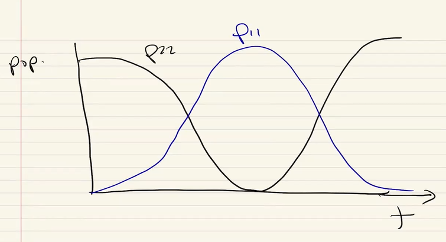

# Density Matrices

## Decoherence

Roughly speaking, decoherence is the process by which a quantum system loses its quantum properties and becomes classical. Meaning that it will go through a non-unitary evolution.

## Density Matrix
If we want to find the evolution of a $n$-state system using a Schrodinger equation, we would need to solve $n$ differential equations, but if we wanted to use the density matrix formalis to count for decoherence, we would need to solve $n^2$ differential equations.

[Ref: Sakurai (non-advanced) Quantum Mechanics, Chapter 3.4]

$$
\hat{\rho}(t) = \sum_i p_i \ket{\psi_i} \bra{\psi_i}
$$

Where if normalized, $\sum_i p_i = 1$.

For example, for the state $\ket{+X}$, the density matrix would be:

$$
\begin{align*}
\hat{\rho} &= \ket{+X} \bra{+X} \, \text{ in the } \ket{X} \text{ basis} \\
\hat{\rho} &= \frac{1}{\sqrt{2}} (\ket{0} + \ket{1}) (\bra{0} + \bra{1}) \frac{1}{\sqrt{2}}
 \\
&= \frac{1}{2} \big( \ket{0} \bra{0} + \ket{0} \bra{1} + \ket{1} \bra{0} + \ket{1} \bra{1} \big) \\
&= \frac{1}{2} \begin{bmatrix} 
1 & 1 \\
1 & 1
\end{bmatrix} \, \text{in the computational basis}
\end{align*}
$$

This was for the case where we had complete knowledge of our quantum system, now what if we have _incomplete knowledge_ of the system? \
For example, we have a source of qubits that at any given point in time, emits a qubit with the following probabilities:

$$
\begin{align*}
\ket{1} &\rightarrow 50\% \\
\ket{0} &\rightarrow 25\% \\
\ket{+X} &\rightarrow 25\% \\
\end{align*}
$$

Then our density matrix would be:

$$
\begin{align*}
\rho &= \frac{1}{2} |1\rangle \langle 1| + \frac{1}{4} |0\rangle \langle 0| + \frac{1}{4} |+X\rangle \langle +X| \\
&= \frac{5}{8} |1\rangle \langle 1| + \frac{3}{8} |0\rangle \langle 0| + \frac{1}{8} ( |0 \rangle \langle 1 | + |1 \rangle \langle 0 | ) \\
\end{align*}
$$

Notice that nowhere here in the statement we require the $\ket{\psi_i}$'s to be orthogonal.

Actually, quantum mechanics doesn't distinguish between an "ensemble" of states having a certain probability distribution and a single state having the same probability distribution.

Now, let's consider two more cases.

- Case 1: We have a qubit that's in state $\ket{0}$ with probability $50\%$ and in state $\ket{1}$ with probability $50\%$.

$$
\rho_1 = \frac{1}{2} |0\rangle \langle 0| + \frac{1}{2} |1\rangle \langle 1|
$$

- Case 2: We have a qubit that's in state $\ket{+X}$ with probability $50\%$ and in state $\ket{-X}$ with probability $50\%$.

$$
\begin{align*}
\rho_2 &= \frac{1}{2} |+X\rangle \langle +X| + \frac{1}{2} |-X\rangle \langle -X| \\
&= \frac{1}{4} ( |0 \rangle \langle 0 | + |0 \rangle \langle 1 | + |1 \rangle \langle 0 | + |1 \rangle \langle 1 | ) \\
&+ \frac{1}{4} ( |0 \rangle \langle 0 | - |0 \rangle \langle 1 | - |1 \rangle \langle 0 | + |1 \rangle \langle 1 | ) \\
&= \frac{1}{2} |0\rangle \langle 0| + \frac{1}{2} |1\rangle \langle 1| \\
&= \rho_1
\end{align*}
$$

We see that these two cases are the same! And this is telling us something, because with both of them they can be in either of the two states with equal probability, so it gives us no information about the state of the qubit. (ergo, same thing.)

Now, if the density matrix of a state can be written in form where it only has $1$ term, then we say that the state is _pure_, and if in any representation (change of basis) it has more than $1$ term, then we say that the state is _mixed_.

Let's learn a few properties of the density matrix.

1. $\rho$ is a Hermitian operator. $\rho = \rho^{\dagger}$
2. The expectation value (in state vectors) $\rightarrow$ the ensemble average (in density matrices):
   $$
   \begin{align*}
   [\hat{A}] &= \sum_i p_i \braket{\psi_i | \hat{A} | \psi_i} \\
   &= \cdots \text{ (Steps skipped)  } \\
   &= Tr(\hat{\rho} \hat{A}) = Tr(\hat{A} \hat{\rho})
   \end{align*}
   $$

3. For $\hat{A} = I$, we have $Tr(\hat{I} \rho) = 1 = Tr(\hat{\rho})$. \
   (Which again means that the density matrix is normalized.)

4. Knowing that we can always re-write $\hat{\rho}$ in an orthonormal basis ($\braket{\psi_i | \psi_j} = \delta_{ij}$), we can see that:
   $$
   \begin{align*}
   Tr(\hat{\rho}^2) &= Tr(\sum_i p_i \ket{\psi_i} \bra{\psi_i} \sum_j p_j \ket{\psi_j} \bra{\psi_j}) \\
   &= Tr(\sum_i p^2_i \ket{\psi_i} \bra{\psi_i}) \\
   &= \sum_i p^2_i \\
   & \leq 1
   \end{align*}
   $$
   This is because these are probabilities, not amplitudes, so their square sum is always less than or equal to $1$, which also means:
    $$
    Tr(\hat{\rho}^2) 1 \iff \text{The state is pure}
    $$

5. For every pure qubit, we can write its density matrix as:
   $$
   \hat{\rho} = a_I \hat{I} + a_X \hat{\sigma}_X + a_Y \hat{\sigma}_Y + a_Z \hat{\sigma}_Z 
   $$
   Where the $a_i$'s are scalar coefficients. 
   
   Now, we want to see whether we really need all $4$ coefficients to describe the density matrix of the qubit.   

   We know that due to purity, $Tr(\hat{\rho}) = 1$, and we also know that only $I$ and $\hat{\sigma}_Z$ are diagonal and contribute to the trace, meaning that 

   $$
    \begin{align*}
    Tr(\hat{\rho}) &= (a_I + a_Z) + (a_I - a_Z) \\
    &= 2 a_I \\
    &= 1 \\
    &\Rightarrow a_I = \frac{1}{2}
    \end{align*}
   $$

   Then to make this more symmetric, we write $a_i = \frac{r_i}{2}$ which gets us to:

   $$
   \begin{align*}
   \hat{\rho} &= \frac{1}{2} (\hat{I} + r_X \hat{\sigma}_X + r_Y \hat{\sigma}_Y + r_Z \hat{\sigma}_Z) \\
   \vec{r} &= r_x \hat{x} + r_y \hat{y} + r_z \hat{z} \\
   \vec{\sigma} &= \sigma_x \hat{x} + \sigma_y \hat{y} + \sigma_z \hat{z} \\
   \Rightarrow \hat{\rho} &= \frac{1}{2} \big( \hat{I} + \vec{r} \cdot \vec{\sigma} \big)
    \end{align*}
   $$

## Time evolution of a density matrix $\hat{\rho}$

Knowing that $\hat{\rho = \sum_i p_i \ket{\psi_i} \bra{\psi_i}}$, we can quickly derive it from the Schrodinger equation. Let's write the Schrodinger equation down again:

$$
\begin{align*}
i \hbar \frac{\partial \ket{\psi_i}}{\partial t} &= \hat{H} \ket{\psi_i} \\
-i \hbar \frac{\partial \bra{\psi_i}}{\partial t} &= \bra{\psi_i} \hat{H}
\end{align*}    
$$

Now let's write down the derivative of the density matrix over time:

$$
\begin{align*}
\frac{\partial \hat{\rho}}{\partial t} &= \sum_i p_i \big( \frac{\partial \ket{\psi_i}}{\partial t} \bra{\psi_i} + \ket{\psi_i} \frac{\partial \bra{\psi_i}}{\partial t} \big) \\
&= \sum_i p_i \big( \frac{ \hat{H} }{i \hbar} \ket{\psi_i} \bra{\psi_i} - \ket{\psi_i} \bra {\psi_i} \frac{\hat{H}}{i \hbar} \big) \\
\Rightarrow i \hbar \frac{\partial \hat{\rho}}{\partial t} &= \sum_i p_i \big( \hat{H} \ket{\psi_i} \bra{\psi_i} - \ket{\psi_i} \bra {\psi_i} \hat{H} \big) \\
&= \hat{H} \sum_i p_i \ket{\psi_i} \bra{\psi_i} - \sum_i p_i \ket{\psi_i} \bra {\psi_i} \hat{H} \\
&= \hat{H} \hat{\rho} - \hat{\rho} \hat{H} \\
&= \big[ \hat{H}, \hat{\rho} \big] \\
\end{align*}
$$

This is called the **Quantum Liouville equation** or the **Master equation**. It describes the time evolution of the density matrix.

Now let's work through some examples:

## Example 1: A two-level system with a near-resonant driving field

As we remember, the Hamiltonian of this system in the rotating frame is:

$$
\begin{align*}
\frac{\hat{H}}{\hbar} &= -\frac{\delta}{2} \hat{\sigma}_Z + \frac{\Omega}{2} \hat{\sigma}_X \\
&= \frac{1}{2} \begin{pmatrix}
-\delta & \Omega \\
\Omega & \delta
\end{pmatrix}
\end{align*}
$$

Writing our density matrix in the most general form:

$$
\hat{\rho} = \begin{pmatrix}
\rho_{11} & \rho_{12} \\
\rho_{21} & \rho_{22}
\end{pmatrix}
$$

We can now write the Liouville equation:

$$
\begin{align*}
[\hat{H}, \hat{\rho}] &= \hbar \begin{pmatrix}
\frac{\Omega}{2} (\rho_{21} - \rho_{12}) & - \delta \rho_{12} + \frac{\Omega}{2} (\rho_{22} - \rho{11} \\
\delta \rho_{21} - \frac{\Omega}{2} (\rho_{22} - \rho_{11}) & -\frac{\Omega}{2} (\rho_{21} - \rho_{12})
\end{pmatrix} \\
\, \\ 
&= i \hbar \frac{\partial \hat{\rho}}{\partial t} = i \hbar \begin{pmatrix}
\dot{\rho_{11}} & \dot{\rho_{12}} \\
\dot{\rho_{21}} & \dot{\rho_{22}}
\end{pmatrix}
\end{align*}
$$

--- 
Sidenote:
Let's see what the ensemble average for the $\hat{P}_1 = | 1 \rangle \langle 1 |$ operator is:

$$
[\hat{P}_1] = Tr \Bigg[ 
\begin{pmatrix}
0 & 0 \\
0 & 1
\end{pmatrix} \begin{pmatrix}
\rho_{11} & \rho_{12} \\
\rho_{21} & \rho_{22}
\end{pmatrix}
\Bigg] = \rho_{22} 
$$

Which means that $\rho_{22}$ is the **population** in $\ket{1}$ and $\rho_{11}$ is the population in $\ket{0}$. \
The off-diagonal elements are the **coherences** between the two states.

---

So our last equation turns into 4 differential equations:

$$
\begin{align*}
\dot{\rho_{11}} &= \frac{\Omega}{2} ( \rho_{21} - \rho_{12} ) \\
\dot{\rho_{12}} &= -\delta \rho_{12} + \frac{\Omega}{2} (\rho_{22} - \rho_{11}) \\
\dot{\rho_{21}} &= \delta \rho_{21} + \frac{\Omega}{2} (\rho_{11} - \rho_{22}) \\
\dot{\rho_{22}} &= \frac{\Omega}{2} ( \rho_{12} - \rho_{21} )
\end{align*}
$$

Solving these, we would get these result (Rabi flopping):

[#skipped, some numerical things with mathematica]