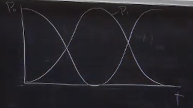
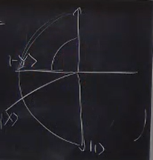

# Time-depndent Perturbation

Previously, for an electron in a magnetic field we had the Hamiltonian

$$
\hat{H} = \mu_B B_z \hat{\sigma}_Z
$$

Where $\mu_B$ is the Bohr magneton and $B_z$ is the strength of the magnetic field in the $z$ direction. This means that the energy difference between the $\ket{0}$ and $\ket{1}$ states is $2 \mu_B B_z$. \
Where $\ket{0}$ has the higher energy $+\mu_B B_z$ and $\ket{1}$ has the lower energy $-\mu_B B_z$.

Now, we want to add a time-dependent perturbation to this Hamiltonian. \
We can do this by adding a term to the Hamiltonian that looks like:

$$
\hat{H} = \mu_B B_z \hat{\sigma}_Z + \mu_B B_x \cos(\omega t + \phi) \hat{\sigma}_X
$$

And for convenience, we rewrite this as:

$$
\frac{\hat{H}}{\hbar} = \frac{\omega_0}{2} \sigma_Z + \Omega \cos(\omega t + \phi) \sigma_X
$$

Where $\omega_0 = 2\mu_B B_z$ is basically the energy split and $\Omega = \mu_B B_x$ is the coupling coefficient. \
We can see that this is a **Rabi flopping** Hamiltonian, with $\omega = \omega_0 + \Omega$ and $\phi = 0$.

The first way we'll solve it is a way we'll probably never do again, but we want to see it first because it's the simplest to follow; since we've already done it.

## The "first" way

Let's say our initial state is some general $\ket{\psi} = a \ket{0} + b \ket{1}$. \
We put this into the Schrodinger equation:

$$
i \frac{d}{dt} \ket{\psi} = \frac{\hat{H}}{\hbar} \ket{\psi} \\
$$

We put the $\frac{\hat{H}}{\hbar}$ we had in to get:

$$
i \dot{a} \ket{0} + i \dot{b} \ket{1} = \frac{\omega_0}{2} a \ket{0} - \frac{\omega_0}{2} b \ket{1} + \Omega \cos(\omega t + \phi) (a \ket{1} - b \ket{0})
$$

Which separates into two equations:

$$
i \dot{a} = \frac{\omega_0}{2} a + \Omega \cos(\omega t + \phi) b \\
\, \\
i \dot{b} = -\frac{\omega_0}{2} b + \Omega \cos(\omega t + \phi) a
$$

To solve these equations, we use some of our old ODE tricks and for both equations, we first pretend that the $\cos$ is a constant and solve for the exponential, then we multiply it by another $t$-dependent term to get the full solution.

$$
a = e^{-i \frac{\omega_0}{2} t} \alpha(t) \\
\, \\
b = e^{i \frac{\omega_0}{2} t} \beta(t)
$$

We put these two back into the original equations and solve for $\alpha$ and $\beta$:

$$
i \dot{a} = i \big( -i \frac{\omega_0}{2} e^{-i \frac{\omega_0}{2} t} \alpha + e^{-i \frac{\omega_0}{2} t} \dot{\alpha} \big) = \frac{\omega_0}{2} e^{-i \frac{\omega_0}{2} t} \alpha + \Omega \cos(\omega t + \phi) e^{i \frac{\omega_0}{2} t} \beta \\
\, \\
i \dot{b} = i \big( -i \frac{\omega_0}{2} e^{i \frac{\omega_0}{2} t} \beta + e^{-i \frac{\omega_0}{2} t} \dot{\beta} \big) = -\frac{\omega_0}{2} e^{i \frac{\omega_0}{2} t} \beta + \Omega \cos(\omega t + \phi) e^{-i \frac{\omega_0}{2} t} \alpha
$$

The first two terms in the equations are the same and are the exact answers that we would've had if we were doing it in the eigenbasis (But we're not, we have a perturbation). So they cancel out.

$$
i \dot{\alpha} = \Omega e^{i \frac{\omega_0}{2} t}  \cos(\omega t + \phi) \beta \\
\, \\
i \dot{\beta} = \Omega e^{-i \frac{\omega_0}{2} t}  \cos(\omega t + \phi) \alpha
$$

Now, we write the cosine as a complex exponential and do the Rotating Wave Approximation (RWA) [$\omega + \omega_0 \approx \infty$]:

$$
i \dot{\alpha} = \frac{\Omega}{2} e^{-i(\omega - \omega_0)t + \phi} \beta \\
\, \\
i \dot{\beta} = \frac{\Omega}{2} e^{i(\omega - \omega_0)t + \phi} \alpha
$$ 

Now, we're going to define something called the detuning $\delta \equiv \omega - \omega_0$, which is basically how far off you are from the resonance frequency.

So:

$$
i \dot{\alpha} = \frac{\Omega}{2} e^{-i \delta t + \phi} \beta \\
\, \\
i \dot{\beta} = \frac{\Omega}{2} e^{i \delta t + \phi} \alpha
$$ 

In class, we'll solve for the case where the detuning is zero $\delta = 0$ and $\phi = 0$, and we'll do it for the non-zero case in the homework.

$$
i \dot{\alpha} = \frac{\Omega}{2} \beta \\
\, \\
i \dot{\beta} = \frac{\Omega}{2} \alpha
$$

We do the old derivating and putting back trick to get:

$$
\alpha = A cos(\frac{\Omega t}{2}) + B sin(\frac{\Omega t}{2}) \\
\, \\
\beta = -iA cos(\frac{\Omega t}{2}) + iB sin(\frac{\Omega t}{2})
$$

For the initial conditions of our problem, let's say we knew that $\ket{\psi(t=0)} = \ket{0}$, \
Therefore $\alpha(t=0) = 1 \rightarrow A = 1$, and $\beta(t=0) = 0 \rightarrow B = 0$. 

Our final solution is:

$$
\ket{\psi} = \cos(\frac{\Omega t}{2}) e^{-i \frac{\omega_0}{2} t} \ket{0} - i \sin(\frac{\Omega t}{2}) e^{i \frac{\omega_0}{2} t} \ket{1}  
$$

We see that the probabilities of being in the $\ket{0}$ and $\ket{1}$ states are:

$$
P_0 = \cos^2(\frac{\Omega t}{2})\\
\, \\
P_1 = \sin^2(\frac{\Omega t}{2})
$$

Plotting these probabilities, we get:

Which shows us that this time-dependent perturbation is oscillating our "population" between the two states.

This type of behaviour (as depicted in the picture) is called **Rabi Oscillations** or **Rabi Flopping**. \
And the $\Omega$ is called the **Rabi Frequency** and $\Omega t$ is called the **pulse area**. 

Notice what happens when $\Omega t = \pi$ (we apply  a $\pi$ pulse), it means that we've done a full trip from $\ket{0}$ to $\ket{1}$. (Or, if we started in $\ket{1}$, we've done a full trip from $\ket{1}$ to $\ket{0}$).

Also, when we apply a $\pi/2$ pulse, we've done half a trip from $\ket{0}$ to $\ket{1}$ (or vice versa). Putting this into the equation for $\ket{\psi}$, we get:

$$
\ket{\psi} = \frac{1}{2} (\ket{0} - i \ket{1}) = \ket{-Y}
$$

Plotting this on a bloch sphere, we see that this is a rotation around the $Y$ axis.

With the same perturbation, if we want to do a rotation around the $X$ axis, we can do it by manipulating the phase $\phi$ of the perturbation. 

## Better way? 

We want to solve this problem using a method called the "Evolution operator". \
A good reference for this is the "Quantum Mechanics" and "Advanced Quantum Mechanics" books by Sakurai. \
[Sidenote: Advanced QM is awesome, he wrote the entire thing himself, but he died half-way through writing QM so it kinda sucks, but that's the one everyone uses nowadays. He was actually a professor here at UCLA.]

The gist of this method is, we assume a time evolution operator $U(t;t_0)$ with a certain set of properties exists (that would make our lives much easier) and we want to find a way to write it. \
This evolution operator is a unitary operator, and we want it to have the following properties 
- It's invertible $U^{\dagger} U = U U^{\dagger} = I$,
- We can use it to evolve our state vector $\ket{\psi(t_0)}$ to $\ket{\psi(t)}$,
- It should also have the property that $U(t_2;t_1)U(t_1;t_0) = U(t_2;t_0)$.
- And should do nothing when the time hasn't changed.  $U(t_0; t_0) = I$
- It should keep the norm of the state vector constant, meaning that:
- $\braket{ \psi(t) | \psi(t)} = I = \braket{ \psi(0) U^{\dagger}(t;0) U(t;0) | \psi(0) }$ = $\braket{ \psi(0) | I | \psi(0) }$

Now, let's say that our state vector is $\ket{\psi(t)} = \hat{U} \ket{\psi(0)}$ and we want to put it into the Schrodinger equation.

$$
i \hbar \frac{d}{dt} \ket{\psi(t)} = H \ket{\psi(t)} \\
\, \\
i \hbar (\frac{d}{dt} \hat{U}) \ket{\psi(0)} = H \hat{U} \ket{\psi(0)} \\
\, \\
i \hbar \frac{d}{dt} \hat{U} = H \hat{U} \\
$$

Now, what we get is a differential equation for the time evolution operator; due to how the nature of the hamiltonian might differ, we have to solve this DE in a different way for each case. 

### Case 1: Time-independent Hamiltonian

An important thing to be wary of here is the commutator of operators being $0$. i.e. $\hat{A} \hat{B} \stackrel{?}{=} \hat{B} \hat{A}$. In the case of time-independent Hamiltonians, we can use the fact that the commutator of the hamiltonian with itself is $0$ to solve the DE. 

$$
\hat{U} = e^{-i \frac{H}{\hbar} t} \\
$$

For example, if we have a hamiltonian that looks like:

$$
H = \frac{\omega_0}{2} \sigma_z
$$

Then we can write the time evolution operator as:

$$
\hat{U} = e^{-i \frac{\omega_0}{2} \sigma_z t} \\
$$

Writing the taylor expansion of this $\hat{U}$, we get:

$$
\begin{align*}
\hat{U} &= \sum_n \frac{1}{n!} (-i \frac{\omega_0}{2} t)^n \hat{\sigma}^n_z \\
&= \hat{I} \cos(\frac{\omega_0}{2} t) - i \hat{\sigma}_z \sin(\frac{\omega_0}{2} t) \\
&= e^{-i \frac{\omega_0}{2} t} |0\rangle \langle 0| + e^{i \frac{\omega_0}{2} t} |1\rangle \langle 1| \\
\end{align*}
$$

In the general case, for a time-independent hamiltonian, we can write the time evolution operator as:

$$
\hat{U}(t) = e^{-i \frac{H}{\hbar} t} = \sum_n e^{-i \frac{E_n}{\hbar} t} \ket{E_n} \bra{E_n}
$$

Where $E_n$ are the eigenvalues of the hamiltonian and $\ket{E_n}$ are the corresponding eigenstates.

We'll consider other cases in the next lecture.