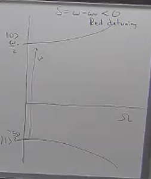
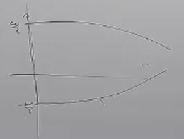

# Rotating Frame

From the previous lecture, our Hamiltonian was:

$$
\frac{\hat{H}}{\hbar} = \frac{\omega_0}{2} \hat{\sigma}_z + \frac{\Omega}{2} \big( e^{i \omega t + \phi}+ e^{-i \omega t + \phi} \big)  \hat{\sigma}_x 
$$

From which we derived the Interaction Hamiltonian:

$$
\begin{align*}
\frac{H_I}{\hbar} &= \frac{\Omega}{2} \big( e^{-i (\delta t + \phi)} |0\rangle \langle 1| + e^{i (\delta t + \phi)} |1\rangle \langle 0 | \big) \\
&= \frac{\Omega}{2} \big( e^{-i (\delta t + \phi)} \hat{\sigma}_{+} + e^{i (\delta t + \phi)} \hat{\sigma}_{-} \big)
\end{align*}
$$

Now, we're trying to solve it for the case where $\delta, \phi \neq 0$; as we can see, this Hamiltonian is now time-dependent, so we can't use the usual method of exponentiating it to get the time-evolution operator. (We'd need to use Dyson Series or Magnus Expansion, which are both complicated and are usually done numerically via computers!) \
We have to resort to tricks whose reasons of existence will become obvious later.

We start by defining the following operator:

$$
\hat{T} = e^{-i \frac{\delta}{2} t} |0\rangle \langle 0| + e^{i \frac{\delta}{2} t} |1\rangle \langle 1|
$$

Then we move the state to the another frame $R$ by using $T$ as our unitary rotation operator:

$$
|\psi_R(t)\rangle = \hat{T} |\psi_I(t)\rangle
$$

Writing down the hamiltonian in the $R$ frame, we get:

$$
\begin{align*}
\frac{H_R}{\hbar} &= \hat{T}^{\dagger} \frac{\hat{H}_I}{\hbar} \hat{T} - i \hat{T}^{\dagger} \frac{d \hat{T} }{dt} \\

&= \frac{\Omega}{2} 
\begin{pmatrix}
e^{+i \frac{\delta}{2} t} & 0 \\
0 & e^{-i \frac{\delta}{2} t}
\end{pmatrix}

\begin{pmatrix}
0 & e^{-i (\delta t + \phi)} \\
e^{+i (\delta t + \phi)} & 0
\end{pmatrix}

\begin{pmatrix}
e^{-i \frac{\delta}{2} t} & 0 \\
0 & e^{+i \frac{\delta}{2} t}
\end{pmatrix} 

- i \begin{pmatrix}
e^{+i \frac{\delta}{2} t} & 0 \\
0 & e^{-i \frac{\delta}{2} t}
\end{pmatrix}

\begin{pmatrix}
-i \frac{\delta}{2} e^{-i \frac{\delta}{2} t} & 0\\
0 &  +i \frac{\delta}{2} e^{+i \frac{\delta}{2} t}
\end{pmatrix} \\

&= \begin{pmatrix}
0 & \frac{\Omega}{2} e^{-i\phi} \\
\frac{\Omega}{2} e^{i \phi} & 0
\end{pmatrix} 
-\begin{pmatrix}
-\frac{\delta}{2} & 0 \\
0 & \frac{\delta}{2} 
\end{pmatrix} \\

&= \frac{1}{2} \begin{pmatrix}
- \delta & \Omega e^{-i \phi} \\
\Omega e^{i \phi} & \delta
\end{pmatrix}

\end{align*}
$$

Now we see something pretty cool; this Hamiltonian is no longer time-dependent! We have moved to a frame where it's become time-independent and therefore commutes with itself at all times! So we can use the usual method (Case 1) of exponentiating it to get the time-evolution operator.

Now, before we enjoy the fruits of our labour, let's take a step back to reflect on what we've done here. Here's a summary of what we've done:

$$
\begin{align*}
\ket{\psi(t)} &= \hat{U}_0 \ket{\psi_I(t)} \\ 
&= \hat{U}_0 \hat{T} \ket{\psi_R(t)} \\
&= \hat{R} \ket{\psi_R(t)}
\end{align*}

$$

Knowing the initial hamitlonian, we write out the explicit form of $R$:

$$
\begin{align*}
\hat{R} &= \hat{U}_0 \hat{T} \\
&= \begin{pmatrix}
e^{-i \frac{\omega_0}{2} t} & 0 \\
0 & e^{+i \frac{\omega_0}{2} t}
\end{pmatrix} \begin{pmatrix}
e^{-i \frac{\delta}{2} t} & 0 \\
0 & e^{+i \frac{\delta}{2} t}
\end{pmatrix} \\
&= \begin{pmatrix}
e^{-i \frac{\omega_0 + \delta}{2} t} & 0 \\
0 & e^{+i \frac{\omega_0 + \delta}{2} t}
\end{pmatrix} \\
&\stackrel{\delta = \omega - \omega_0}{=} \begin{pmatrix}
e^{-i \frac{\omega}{2} t} & 0 \\
0 & e^{+i \frac{\omega}{2} t}
\end{pmatrix}
\end{align*}
$$

So this is a frame which is _not_ rotating as we originally guessed at $\omega_0$ (which is the interaction frame that we put the state in by applying $U_0$). \
Instead, it's rotating at $\omega = \omega_0 + \delta$; which is the frequency of the interaction. This is what's called the **Rotating Frame**.

Note: Even though the rotating frame is awesome for this problem, the issue is that it gets really clunky. In general, if you add another level, you're always going to have some time-dependent term, and you'll get confused about what to do, but **the interaction picture is always your friend.**
So always first take it to the interaction picture, and then if you still have some terms left that you can get rid of, then you can move to the rotating frame; otherwise you should use other methods.

---
As a sidenote, if we have:

$$
\vec{\sigma} = \sigma_x \hat{x} + \sigma_y \hat{y} + \sigma_z \hat{z} \\
\vec{n} = n_x \hat{x} + n_y \hat{y} + n_z \hat{z} \\
$$

Where $\vec{\sigma}$ is a vector of Pauli Matrices called the **Pauli vector** and $\vec{n}$ a normalized vector of scalars is called the **spin vector**, then we can write:

Then we can write:
$$
e^{-i \theta \vec{\sigma} \cdot \vec{n}} = \cos \theta \hat{I} + i \sin \theta (\vec{\sigma} \cdot \vec{n})
$$
---

Alright, now we re-write our hamiltonian in the rotating frame as:

$$
\begin{align*}
\hat{H}_R &= \frac{-\delta}{2} \hat{\sigma}_z + \frac{\Omega}{2} \big( \hat{\sigma}_{+} e^{-i\phi} + \hat{\sigma}_{-} e^{+i\phi} \big) \\
&= \frac{\Omega'}{2} \big( -\frac{\delta}{\Omega'} \hat{\sigma}_z + \frac{\Omega}{\Omega'} (\cos(\phi) \hat{\sigma}_x + \sin(\phi) \hat{\sigma}_y) \big)
\end{align*}
$$

Where $\Omega' = \sqrt{\Omega^2 + \delta^2}$.

Where we put it in the second form because it looks like inner product of a pauli vector and a spin vector, where:

$$
\vec{n} = \frac{\Omega}{\Omega'} (\cos(\phi) \hat{x} + \frac{\Omega}{\Omega'} \sin(\phi) \hat{y}) - \frac{\delta}{\Omega'} \hat{z}
$$

We also need to check the normalization of the spin vector, which is:

$$
\begin{align*}
\vec{n} \cdot \vec{n} &= \frac{\Omega^2}{\Omega'^2} (\cos^2(\phi) + \sin^2(\phi)) + \frac{\delta^2}{\Omega'^2} \\
&= \frac{\Omega^2}{\Omega'^2} + \frac{\delta^2}{\Omega'^2} \\
&= 1
\end{align*}
$$

Remember that this is time-independent, so we can exponentiate it to get the time-evolution operator:

$$
\begin{align*}
\hat{U}_R &= e^{-i \hat{H}_R t / \hbar} \\
&= \cos(\frac{\Omega' t}{2}) \hat{I} - i \sin(\frac{\Omega' t}{2}) \Big( -\frac{\delta}{\Omega'} \hat{\sigma}_z + \frac{\Omega}{\Omega'} (\cos(\phi) \hat{\sigma}_x + \sin(\phi) \hat{\sigma}_y) \Big) \\
\end{align*}
$$

This time-evolution operator is extremely important in Quantum Computing, and we can derive so many operations from it. Let's see a couple of examples.

### Examples

 

  1. When $\delta = 0$ (no detuning) and $\Omega t = \pi$ ($\pi$-pulse) then we get:
     $$\hat{U}_R = -i \big( \cos(\phi)\hat{\sigma}_x + \sin(\phi) \hat{\sigma}_y \big)$$
     1.1. 
      $$\phi = 0 \rightarrow \hat{U}_R = -i \hat{\sigma}_x $$
     1.2.   
      $$\phi = \pi/2 \rightarrow \hat{U}_R = -i \hat{\sigma}_y $$

  2. When $\delta >> \Omega$ (strong detuning) and $\Omega t = \pi$ ($\pi$-pulse) then we get:
     $$
     \hat{U}_R = +i \frac{\delta}{\Omega'} \hat{\sigma}_z = +i \hat{\sigma}_z
     $$

Now, we want go back to the lab frame for a second, but let's first check the general case where only $\delta >> \Omega$, then:

$$
\begin{align*}
\hat{U}_R &= \cos(\frac{\Omega' t}{2}) \hat{I} + i \sin(\frac{\Omega' t}{2}) \Big( \frac{\delta}{\Omega'} \hat{\sigma}_z \Big) \\
&= \cos(\frac{\Omega' t}{2}) \hat{I} + i \sin(\frac{\Omega' t}{2}) \hat{\sigma}_z  \\
&= e^{-i \frac{\Omega'}{2} t} |0\rangle \langle 0 | + e^{+i \frac{\Omega'}{2} t} |1\rangle \langle 1 | \\
\end{align*}
$$

Notice that although this evolution keeps any state in its original position, we do get an extra phase factor between the two states; which means that this "drive" is shifting the energies $e^{-iEt}$ of these two states.

Let's go back to the lab frame to see what the total energy shift is after the state gets evolved by $\hat{U}_R$:

$$
\begin{align*}
|\psi(t)\rangle &= \hat{U}_0 \hat{T} \ket{\psi_R(t)} = \hat{R} \ket{\psi_R(t)} \\
&= \hat{R} \hat{U}_R \ket{\psi_R(0)} \\
\end{align*}
$$

So the operator that's shifting our energies is the $\hat{R} \hat{U}_R$ operator, which is:

$$
\begin{align*}
\hat{R} \hat{U}_R &= \Big( e^{-i \frac{\omega}{2} t} |0\rangle \langle 0 | + e^{+i \frac{\omega}{2} t} |1\rangle \langle 1 | \Big) \Big( e^{-i \frac{\Omega'}{2} t} |0\rangle \langle 0 | + e^{+i \frac{\Omega'}{2} t} |1\rangle \langle 1 | \Big) \\
&= e^{-i \frac{\omega - \Omega'}{2} t} |0\rangle \langle 0 | + e^{+i \frac{\omega + \Omega'}{2} t} |1\rangle \langle 1 | \\
\end{align*}
$$

First, let's look more closely at $\Omega'$, by remembering that  $\delta >> \Omega$ in this case: 

$$
\begin{align*}
\Omega' &= \sqrt{\Omega^2 + \delta^2} \\
&= \delta \sqrt{1 + (\frac{\Omega}{\delta})^2} \\
&\stackrel{Taylor}{\approx} \delta (1 + \frac{1}{2} (\frac{\Omega}{\delta})^2)
\end{align*}
$$

Now, extracting the phase (energy shifts) from the $\hat{R} \hat{U}_R$ operator:

$$
\begin{align*}
E_0 &= \frac{1}{2} (\omega - \Omega') \\
&= \frac{1}{2} (\omega - \delta - \frac{1}{2} (\frac{\Omega}{\delta})^2) \\
&\stackrel{\delta = \omega - \omega_0}{=} \frac{\omega_0}{2} - \frac{1}{4}  (\frac{\Omega}{\delta})^2
\, \\
\, \\
E_1 &= \frac{1}{2} (\omega + \Omega') = \cdots \\
&= -\frac{\omega_0}{2} + \frac{1}{4}  (\frac{\Omega}{\delta})^2
\end{align*}
$$

Where the $\frac{1}{4}  (\frac{\Omega}{\delta})^2$ term is called the AC Stark shift.

So we see that the energy shifts change as we change the detuning $\delta$ and the Rabi frequency $\Omega$. \
Also, if $\delta = \omega - \omega_0 < 0$ it's called a red detuning, and if $\delta = \omega - \omega_0 > 0$ it's called a blue detuning.

Diagrams showing the energy shifts for different detunings and Rabi frequencies:

For $\Omega$: \

For $\delta$: \

