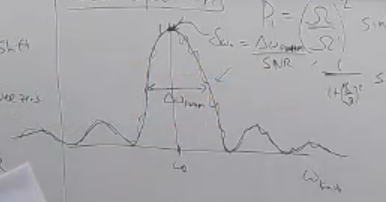
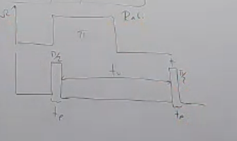
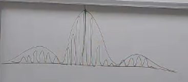
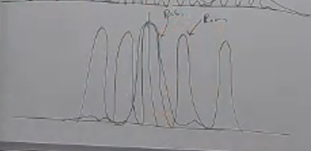

# Spectroscopy

## Rabi Spectroscopy

Imagine we have a quantum computer that uses rabi oscillations. We want to measure its $\omega_0$ (frequency difference between the ground and the excited state), $\omega$ (frequency of the rabi perturbation) to make sure we're applying the right pulse, how do we do this stuff? How do we calibrate? \
This measurement is called spectroscopy, which means we use our system to measure the energy splitting between the ground and excited state. \
(We do realize that the energy splitting is a constant for a given type of atom for example, but the laser and the equipment that we're working on are man-made and they'll run out of calibration eventually.)

One way to do it is to maybe prepare $\ket{0}$ and then apply a $\pi$-pulse and measure the probability of being in the excited state.

$$
\begin{align*}
P_1 &= \big( \frac{\Omega}{\Omega'} \big)^2 \sin^2 \big( \frac{\Omega' t}{2} \big) \\
& \stackrel{\text{in this case}}{=} \frac{1}{1 + (\frac{\delta}{\Omega})^2} \sin^2 \big( \frac{\pi}{2} \sqrt{1 + (\frac{\delta}{\Omega})^2} \big)
\end{align*}
$$

Well, we see that this is a $sinc$ function in $\delta$ (since $\delta$ is the knob we can turn in our device), so it will look like this (with the $x$-axis being $\delta$):

So we know we're somewhere on this plot, but we want to find the exact $\omega_0$ value that will give us the maximum probability of being in the excited state. But we also know that the data we'll get is going to be noisy, so we'll have to do some fitting to get the exact value; and what we find is that our best estimate for $\omega_0$ is:

$$
\delta \omega_0 = \frac{\Delta \omega_{0_{FWHM}}}{SNR}
$$

Where $\Delta \omega_{0_{FWHM}}$ is the full width at half maximum of the peak, and $SNR$ is the signal to noise ratio. The FMWH is the width between the two points where the curve is at half the maximum value, and the SNR is the (square) ratio between the mean value and the standard deviation of the noise. i.e. $SNR = (\frac{\mu}{\sigma})^2$

We want to make the horizontal line (HWHM) as narrow as possible, SNR as large as possible. For narrowing the HWMW, we need to find the point where our $P_1 = 0.5$, which put into a computer to solve and we see that it happens when $\delta = 0.8 \Omega$, which means that the $\Delta \omega_{0_{FWHM}} = 1.6 \Omega \approx \frac{\pi}{2} \Omega$.

This means that to decrease the FMWH, we need to decrease the $\Omega$ value, so our $\Omega' t$ term in the sine will decrease, meaning that we'll have to apply the pulse for a longer time to get the same $\pi$. \
From a Fourier sampling point of view, this sounds great because our time-sampling window $t$ has become longer, we should be able to have better resolution. 

Another point to consider is that we'll have a practical limit on how small we can make the $\Omega$ value, because this thing is going to have (outside) noise, and at really small values the frequency itself won't be stable, which means that we'll have to broaden it. (The phenomenon is called **Broadening**) 

## Ramsey Spectroscopy

As opposed to Rabi, which says that we're applying a $\pi$-pulse continously, Ramsey says let's do a $\frac{\pi}{2}$-pulse (which takes time $t_P$), wait for a while ($t_W$), and then do another $\frac{\pi}{2}$-pulse.

 \
(Top is Rabi, bottom is Ramsey)

So we already know how to apply either a $\pi$ or a $\frac{\pi}{2}$-pulse, which was done with the $\hat{U}_R$ operator, so we can just do that and measure the probability of being in the excited state. \
But what about the waiting operator?

Remembering that what our rotating frame hamiltonian was, we know that doing nothing means $\Omega = 0$, because it means that the strength of the perturbation is zero.

$$
\begin{align*}
\hat{H}_R &= \frac{-\delta}{2} \hat{\sigma}_z + \frac{\Omega}{2} \big( \hat{\sigma}_{+} e^{-i\phi} + \hat{\sigma}_{-} e^{+i\phi} \big) \\
&=  \frac{-\delta}{2} \hat{\sigma}_z 
\end{align*}
$$

Therefore the waiting operator $\hat{U}_W$ is just the exponential of this hamiltonian:

$$
\begin{align*}
\hat{U}_W &= e^{-i \hat{H}_R t} \\
&= e^{+i \frac{\delta}{2} \hat{\sigma}_z t} \\
&= \begin{pmatrix}
e^{+i \frac{\delta}{2} t} & 0 \\
0 & e^{-i \frac{\delta}{2} t}
\end{pmatrix}
\end{align*}
$$

So we can construct our full Ramsey operator:

$$
\hat{U}_{Ramsey} = \hat{U}_R(\Omega t = \frac{\pi}{2}, \delta, \phi) \hat{U}_W \hat{U}_R(\Omega t = \frac{\pi}{2}, \delta, \phi = 0)
$$

Which gets us to the following probability of being in the excited state:

$$
P_1 = |\braket{1 | \hat{U}_{Ramsey} | 0 } |^2 = (\frac{\Omega}{\Omega'})^2 \Big( \frac{\Omega}{\Omega'} \cos(\frac{\delta t_W}{2}) \sin(\frac{\Omega' t_P}{2}) - 2 \frac{\delta}{\Omega'} \sin(\frac{\delta t_W}{2}) \sin(\frac{\Omega' t_P}{2}) \Big)^2
$$

So how does this look like?

Which are the oscillations which go right underneath an "envelope" of the $sinc$ Rabi $P_1$.

So this thing is setting the _shape_, but the _resolution_ is set by the entire $t_P + t_W + t_P$ time.

So you'd think that this is much better than the Rabi spcectrosopy, right? (Since it's much more refined and has a much better resolution), but this is not a fair comparison, because the Rabi spectroscopy only takes a time where $\Omega' t = \pi$, which is a very small time, but the Ramsey takes that entire time; so if we're going to compare them, we need to compare them for the same amount of time. (Rabi spectroscopy also applied for the $t_P + t_W + t_P$ time)

So, the cool thing about Ramsey spectroscopy and one of its advantages is that when we're applying the two separate pulses, we can crank up the $\Omega$ as much as we want here, since we just want to do a $\frac{\pi}{2}$-pulse. The _resolution_ has nothing to do with how _fast_ we do apply the pulse (we can do it instantly!), but it has to do with how much we wait in between. \
So if we assume that the $\Omega$ is really large, we can see how our $P_1$ looks like:

$$
P_1 = \Big( \cos(\frac{\delta t_W}{2}) \sin(\frac{\Omega' t_P}{2}) \Big) \approx \cos(\frac{\delta t_W}{2})
$$

Where we did the last approximation because we assumed that $\Omega' t_P \approx \frac{\pi}{2}$, which means that we're applying a $\frac{\pi}{2}$-pulse. 

And solving this to get its FWWM, we get:

$$
\frac{1}{2} = \cos(\frac{\delta t_W}{2}) \\ \implies \Delta_{FWHM}^{Ramsey} = \frac{\pi}{t_W}
$$

For a Rabi with the same amount of time, we have $\Omega t = \pi \implies \Omega = \frac{\pi}{t_W}$, therefore:

$$
\Delta_{FWHM}^{Rabi} = \frac{\pi}{2} \Omega = \frac{\pi}{2}\frac{\Omega}{t_W}
$$

What this means is that if we can actually do the experiment (using same amount of time for both), the Ramsey will be the better way to do it because the FWHM is smaller by a factor of $\Omega$.

[#skipped, there's a really good explanation of this shown on the bloch sphere that I've refrained from writing down because it's really visual and you should watch it yourself. from 0:44:55 - 0:49:25]

# Harmonic Oscillators
[#skipped]
