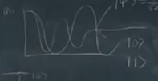
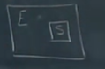
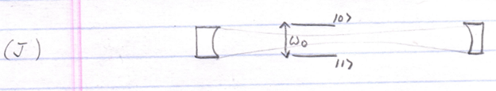
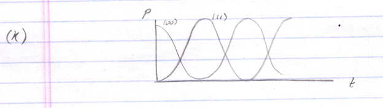

# Lecture 1:

We began with the Schrödinger Equation. This allows us to find the evolution of a quantum system in time. But it can be too complicated when we start to treat systems of multiple elements, like multiple qubits for example. 

One way to surmount this difficulty is by using the time evolution operator, $U$. \
Applying this operator, specified for a particular time, to the expression for the quantum state at an initial time yields the expression for the quantum state at the later time chosen. \
The way to find this operator is with the Magnus expansion. But, if you are lucky, and the Hamiltonian is time independent, then we can use the simple equation $e^{-iHt/\hbar}$. The time evolution operator is unitary, it just moves the state vector around in HS. 

We looked at things like Rabi flopping, in which we apply a resonant perturbation to the potential energy function of a two level system, and cause it to evolve from $\ket{0}$ to $\ket{1}$ and back. 

 

(?) But there are some situations in which the evolution dampens and dies off. In such cases we do not say that the state is in a superposition like this:

$$
\ket{\psi} = \frac{1}{\sqrt{2}} (\ket{0} + \ket{1})
$$
 

But rather that it is probabilistically distributed 50-50 for example. How do we describe this? We cannot use a state vector, we had to use the density operator. (?)

$$
\hat{\rho} = \sum_i p_i \ket{\psi_i}\bra{\psi_i}
$$ 

For our example:

$$
\hat{\rho} = \frac{1}{2} \ket{0}\bra{0} + \frac{1}{2} \ket{1}\bra{1}
$$

So how do we treat time evolution with the density operator? We apply the time evolution operator to get the density matrix at a later time. 

(A)
 
$$
\begin{align*}
\hat{\rho'} 
&= U \hat{\rho_0} U^\dagger \\
&= \sum_i p_i \, U \ket{\psi_i}\bra{\psi_i} U^\dagger \\
\end{align*}
$$

$$
i \hbar \frac{d}{dt} \hat{\rho} = \left[ \hat{H}, \hat{\rho} \right]
$$

We then derived the **Quantum-Liouville Equation**, from which we can solve the evolution of the density matrix. 

But both of these ways of evolving the density matrix are unitary. \
So we still do not have the machinery to evolve from a pure state to a mixed state. But really, we did not go to a mixed state in the example above, it just looked like we did because we are not keeping track of everything. (?) \
But the qubit, for example, is just coupled to many other things and the evolution under this condition brings about the result of a seemingly random distribution, or non-pure state. Say the qubit is coupled to the environment $\ket{\psi} = \ket{q_1 e_1} + \ket{q_2 e_2}$. \
We are not keeping track of the environment because we can’t. So we forget about that information. 

How do we “forget” about part of the system (usually the environment) formally? We use the partial trace over the element of the system we want to forget. 

(B)
$$
\hat{\rho} A = \text{Tr}_B \hat{\rho}_{AB}
$$

For example, say we have a Bell state. 

(C)  

$$
\hat{\rho}_{AB} = \ket{\Phi^+}\bra{\Phi^+} = \frac{1}{2} \left( \ket{00} + \ket{11} \right) \left( \bra{00} + \bra{11} \right)
$$

$$
\begin{align*}
\hat{\rho}_A 
&= \text{Tr}_B \hat{\rho}_{AB} \\

&= \text{Tr}_B \left( \frac{1}{2} \left( \ket{00} + \ket{11} \right) \left( \bra{00} + \bra{11} \right) \right) \\

&= \frac{1}{2} Tr_B (\ket{00} \bra{00} + \ket{00} \bra{11} + \ket{11} \bra{00} + \ket{11} \bra{11}) \\

&= \frac{1}{2} \sum_{i} \bra{i}_{B} \big( \ket{0}_A\bra{0}_{A} \otimes \ket{0}_B \bra{0}_B + \ket{0}_A \bra{1}_A \otimes \ket{0}_B \bra{1}_B + \ket{1}_A \bra{0}_A \otimes \ket{1}_B \bra{0}_B + \ket{1}_A \bra{1}_A \otimes \ket{1}_B \bra{1}_B \big) \ket{i}_B \\

&= \frac{1}{2} \left( \ket{0} \bra{0} + \ket{1} \bra{1} \right) \\
\end{align*}
$$

The result is a mixed state density matrix– no coherence. (?) And this is the same thing as we would do in the qubit flopping case– tracing over the environment gives us our mixed state.

$$
\hat{\rho} = \frac{1}{2} \ket{0}\bra{0} + \frac{1}{2} \ket{1}\bra{1}
$$

This is decoherence. **Decoherence** is unaccounted for entanglement: Everything is evolving via the Schrödinger Equation or Quantum-Liouville Equation, but we cannot keep track of everything, and so the result is decoherence to a seemingly mixed state. (I guess that the reason it is said to be an **“incoherent state”** is because no interference effects between the substates involved in the expression characterizing the system – the density matrix – takes place; whereas, in a coherent state, or a pure state, interference effects between the substates involved in the expression characterizing the system – the state ket for instance, do take place. Interference processes are features of entanglement. ) 

So we need a way to account for all of this. We need equations which give us the evolution of the density matrix for situations in which we just cannot keep track of everything. In principle, we could just use the Schrödinger Equation, or the Quantum-Liouville Equation. But the complexity is too great. So there are two ways:

### First – Quantum Channel Description 

The name comes from how it is used to treat information transmission over a noisy channel, but the applications go far beyond this. 

How it works: Imagine that we have the universe, and we artificially define one circumscribed part of it to be a system of interest. 

We are assuming a lot in this separation. How can we really pull any part of the universe apart if everything is coupled together? Further, the time evolution of the quantum state depends on what things are included as coupled in that state, so by not including the rest of the universe in our state, we could get an inaccurate time evolution result. Well, we just assume, and the assumption is useful and legitimate, that the coupling is small enough to “get a handle over it” (meaning ignore it I think). This is what we do in quantum computing: We assume the coupling between the qubit system and the environment is small. This allows us (?) to express the density matrix of the universe as a tensor product of a system and environment density matrix. 

(D) 

$$
\hat{\rho}_{SE} (t=0) = \hat{\rho}_S (t=0) \otimes \hat{\rho}_E (t=0)
$$

We cannot always do this, because, really, the environment and the system are usually entangled, in which case we cannot write the state of the universe as a tensor product of the density matrix of each. But we need to do this for things in quantum computing. Our state preparation process does this (?) – it makes the state preparation separable. 

What is the density matrix at a later time? We just apply the usual equation for the density matrix as a function of time. 

(E)

$$
\hat{\rho}_{SE} (t) = \hat{U}_{SE} (t) \hat{\rho}_{SE} (t=0) \hat{U}_{SE}^\dagger (t)
$$
 

Of, course, finding $U_{SE}$ is very hard. But we will worry about that later. 

We only are interested in the system density matrix, so we perform a partial trace. 

(F)

$$
\begin{align*}
\hat{\rho}_S (t) &= \text{Tr}_E \hat{\rho}_{SE} (t) \\
&= \sum_{i} \bra{e_i} \hat{U}_{SE} \hat{\rho}_S (t=0) \otimes \hat{\rho}_E (t=0) \hat{U}_{SE}^\dagger \ket{e_i} \\
&= \sum_{i} \bra{e_i} \hat{U}_{SE} \hat{\rho}_S (t=0) \otimes \ket{e_0} \bra{e_0} \hat{U}_{SE}^\dagger \ket{e_i} \\
\end{align*}
$$
 

Then we assume that the environment starts in a pure state. (? Why does this “sound like a crazy assumption”? I think because, though the universe is a pure state (theoretically), if we truncate it into system and environment, the environment is no longer pure– something like that?) It turns out that this treatment is what you do when the environment is a thermal state– more on that later. 

A case in which this would be a good approximation would be spontaneous emission. Say you have an atom that is excited by a UV photon. There are not that many UV photons bouncing around in here right now (the lecture hall). So we can think of the room (environment) as a vacuum with respect to the atom. 

So, this assumption made, we can do the following:

(G)

$$
\begin{align*}
\hat{\rho}_S (t) &= \text{Tr}_E \hat{\rho}_{SE} (t) \\
&= \sum_{i} \bra{e_i} \hat{U}_{SE} \hat{\rho}_S (t=0) \otimes \hat{\rho}_E (t=0) \hat{U}_{SE}^\dagger \ket{e_i} \\
&= \sum_{i} \bra{e_i} \hat{U}_{SE} \hat{\rho}_S (t=0) \otimes \ket{e_0} \bra{e_0} \hat{U}_{SE}^\dagger \ket{e_i} \\
&= \sum_{i} \bra{e_i} \hat{U}_{SE} \hat{\rho}_S (t=0) \ket{e_0} \hat{\rho}_{S} (t=0) \bra{e_0} \hat{U}_{SE}^\dagger \ket{e_i} \\
\end{align*}
$$

Since the parts on both sides of the $\hat{\rho}_S (t=0)$ are conjugates of each other, we can write them in a different way to show the evolution of the system.

$$
\hat{\rho}_S(t=0) = \sum_{i} \hat{K_i} \hat{\rho}_S(t=0) \hat{K_i}^\dagger
$$

The K hats are “Kraus operators”. 

This equation is called the **“Quantum Channel Description”**, “Operator-Sum Representation”, “Quantum Jump Formalism”... it has lots of names (it is relatively new). 

(( So, the Kraus operators are basically computational devices which encode the time evolution operator of the total System (capital “s”-- that is, the total System which is a combination of the system of interest and the environment) in combination with the partial trace manipulation. These devices can then be applied to the initial state of the s component of the System to yield the expression for the density matrix of the s component of the System as a function of time. )) 

So, this tells us how to find the density matrix of our system at some later time. We just need the Kraus operators– these only operate on the system part of the Hilbert space. 

You can even think of the Quantum Channel Description  as a sum of density matrices, each with a certain weight determined by how the Kraus operators act on the initial density matrix for the system. 

(H)

$$
\hat{\rho}_S (t) = \sum_{i} w_i \hat{\rho_S}_i = \sum_{i} w_i \ket{\psi_{Si} } \bra{\psi_{Si} }
$$
 
So we can think of the Quantum Channel Description  as a weighted sum of all of the possible outcomes of the system that could happen– each corresponding to a different outcome for the environment. For example: Say the photon was emitted one way, or another way, etc. 

Each of these possible outcome-states of the system is a pure state. So we have an incoherent weighted sum of pure states. 

$$
\hat{\rho}_S (t) = \sum_{i} \hat{K}_i \ket{\psi_{Si} } \hat{K}_i^{\dagger}
$$
 

Question: How do we get those $\hat{K}$s? This is the hard part. From the equation (G) we see that we need all of the states of the environment, and the time evolution operator for the whole universe. People have spent time making approximations of what the Kraus operators should be for certain kinds of noisy situations. So, generally, you just look up which one fits your situation and use that. 

Let’s look at the Kraus operator for **spontaneous emission**. This is a big source of decoherence– the universe is a big space, and the photons have many places to go with very low probability that they will return. Spontaneous emission is relevant for trapped ions, N-V centers, sometimes in superconducting qubits, etc. Sometimes we use spontaneous emission for state preparation. So it is everywhere, we need to understand it. 

Again, we have the expression for the Kraus operator:

(I)

$$
\hat{K}_i = \braket{e_i \, | \, \hat{U}_{SE} \, | \, e_0}
$$
 

We need to define our basis and our system. Let’s say our system is a qubit. Our environment should now be all of the electromagnetic modes of free space. But these are infinite in number. So, to get around this difficulty, we suppose that the environment is an optical cavity. Spontaneous Emission is seen in an optical cavity. 

(J)

 

Classically, this does not happen. But it does happen in QM. 

Once it does happen, it can come back, and you can have probabilities that look like this over time: 

(K)

 

Trick: We will calculate the Kraus operators using this model, but only looking in the limit of a short time. That is, when the photon goes out, it will come back after a certain time. But we are going to shrink the time interval of interest to a size that is small enough that the probability that it will return is negligible. So we will expand the probability function near t=0, and look at the rates, and these will be taken as the rates of spontaneous emission. 

We begin the derivation with the Hamiltonian for our system. Recall that the Hamiltonian for a two-level system (qubit) in a harmonic oscillator potential well is the Jaynes-Cummings hamiltonian. 

(L)

$$
\frac{\hat{H}}{\hbar} = 
\underbrace{\frac{\omega_0}{2} \hat{\sigma}_z}_{qubit} + 
\underbrace{\omega (\hat{a}^{\dagger} \hat{a} + \frac{1}{2})}_{\text{harmonic oscillator}} + 
\underbrace{\frac{g}{2} (\hat{\sigma}_{+} \hat{a} + \hat{\sigma}_{-} \hat{a}^{\dagger})}_{\text{coupling}}
$$

Recall that this expression is based on the rotating wave approximation. 

We worked out the time evolution operator for this. In the case of |00> (only one excitation in the system), we had the Rabi flopping time evolution operator:

(M)
 
$$
\hat{U}^{(1)}_{JC} = \begin{pmatrix}
\cos(\frac{\Omega t}{2}) & -i \sin(\frac{\Omega t}{2}) \\
\, \\
-i \sin(\frac{\Omega t}{2}) & \cos(\frac{\Omega t}{2}) \\
\end{pmatrix}
$$

Here, we say that the detuning ($= \delta = (\omega - \omega_0)$) is $0$, or $\omega = \omega_0$. \
This means that the cavity is on resonance with the photon. (? I guess this means this means that the cavity is capable of holding the photon with a particular frequency, a frequency matching the energy shift of the qubit inside in this case.) The universe can be thought of as a cavity on resonance since it can definitely hold the photon. 

So, we have the $U$ of the system, how do we get the $U$ of the system-environment? 

(? The idea seems to be that, if we say that the system needs to have the possibility of being in a state where nothing happens, we think of what that state is for this situation, namely $\ket{10}$, and find the time evolution operator for that state, which would be $\ket{10}\bra{10}$ (since it does nothing to the state, leaving it constant over time), and then simply add this time evolution operator to the one we have for the case of $\ket{00}$ given above. Why this works I do not know.) 

(N)

$$
\begin{align*}
\hat{U}_{SE} &= \hat{U}^{(1)}_{JC} + \ket{10}\bra{10} \\
\, \\
&= \ket{10}\bra{10} \\
&+ \cos(\frac{\Omega  t}{2}) (\ket{00}\bra{00} + \ket{11}\bra{11}) \\
&- i \sin(\frac{\Omega  t}{2}) (\ket{00}\bra{11} - \ket{11}\bra{00}) \\
\end{align*}
$$ 

Here $n = 0$, because there is one unit of excitation. (?) It is the coupling between the atom and the cavity. 

So we now have our U for the system and the environment for the case in which one unit of excitation is shared between the qubit and the cavity. And, now that we have U_se we can calculate our Kraus operators. 

Our environmental states are just the Fock states representing how many photons, n, are in the cavity. By equation (I) we will have one Kraus operator for every environment state. Here, we will assume that the environment starts in a vacuum state– which isn’t a bad assumption as we are working with UV recall, and there are not many UV photons in here, especially with the same frequency, direction etc. as that needed to be held in the cavity of our example. (44:55)

(O)

$$
\begin{align*} 
\ket{e_0} &= \ket{n} = \ket{0} \\

\hat{K}_0 &= \braket{0 | \hat{U}_{SE} | 0} = \ket{1}_{S}\bra{1}_{S} + \cos(\frac{\Omega t}{2}) \ket{0}_{S}\bra{0}_{S} \\

\hat{K}_1 &= \braket{1 | \hat{U}_{SE} | 0} = -i \sin(\frac{\Omega t}{2}) \ket{1}_{S}\bra{0}_{S} \\

\hat{K}_2 &= \braket{2 | \hat{U}_{SE} | 0} = 0 \\

&\vdots \\

\hat{K}_m &= \braket{m | \hat{U}_{SE} | 0} = 0 \\

\end{align*}
$$
 

Notice that the Kraus operators operate only on the qubit. We find that there are only 2 for this situation. 

Can we get physical intuition about these Kraus operators? Before we get to that, we will look at the short timescale limit mentioned above. 

Let’s look at $K_1$ and then $K_0$. 

(P)

$$
\begin{align*} 
\hat{K}_1 &= -i \sin(\frac{\Omega t}{2}) \ket{1}_{S}\bra{0}_{S} \\ 
&\stackrel{\text{small } t}{\rightarrow} \sqrt{p} \ket{1}_S \bra{0}_S
\end{align*}
\\
$$
 
Which then gives:

$$
\hat{K}_0 = \ket{1}\bra{1} + \sqrt{1-p} \ket{0}\bra{0}
$$

Defining the value $p$ as above leads to the expression for $K)0$ and $K_1$. 

So, we now have our two Kraus operators for our system (based on the short timescale approximation/analogy). Let’s calculate the Quantum Channel for a quantum state. 

Say we begin with the qubit (the system) in the excited state. Then look at the expression for this over time. Then calculate. 

(Q)

$$
\hat{\rho}_S (t=0) = \ket{0}\bra{0}
$$

Then,

$$
\begin{align*} 
\hat{\rho}_S (t) &= \sum_{i} \hat{K}_i \ket{0}\bra{0} \hat{K}_i^\dagger \\

&= \hat{K}_0 \ket{0}\bra{0} \hat{K}_0^\dagger + \hat{K}_1 \ket{0}\bra{0} \hat{K}_1^\dagger \\
&\cdots \\

&= (1-p) \ket{0}\bra{0} + p \ket{1}\bra{1} \\
\end{align*}
$$
 

(? I guess the conjugation of the $p$s in the expression are not important)

This is very intuitive if we view $p$ as the probability that the photon will be emitted. 

Notice that $K_0$ can be thought of really as a spontaneous emission operator. (?)We take an excited state and couple it to a ground state with some probability amplitude. On the other hand, $K_1$ is sometimes called the “No Jump Operator”. This is an example of a weak measurement. Say we had a vacuum and a detector, and we do not detect a photon. This is then like operating with just the “no jump operator”. We will discuss this more later. But, the “no jump operator” will give you the evolution (of the density matrix for the system?) If the photon didn’t come out, then the probability of the qubit being in an excited state is reduced. You gain information by this weak measurement. The longer you look at an atom and it doesn’t emit, the more certain it is that it is not excited. 

### Types of Kraus Operators

Sometimes, these (??) are called “channels”. For instance, the one discussed above was the spontaneous emission channel. Another channel might be the bit flip channel, which is just a situation in which one has a qubit which has a probability of getting flipped. (So I guess the “channels” are particular situations we encounter and treat formally in a specific way– like the situation of spontaneous emission which we treated above in a certain way; making approximations, analogies etc. to guide the formal treatment. The idea is, then, that we have crafted certain formal treatments of general physical situations – like spontaneous emission, bit flip, etc. –, and so these formal treatments can now be applied in many different instances in which we investigate a physical situation that corresponds to one of the general types. For example, we can apply the mathematics developed for spontaneous emission channel to all particular instances of spontaneous emission, regardless of what the specific physical system that is undergoing that spontaneous emission might be, or we can apply the mathematics of the bit flip channel, regardless of what physical realization the channel might take.) 

### Bit Flip Channel

Say we have a qubit in an initial state |0> or |1>. Say that it has a probability of flipping from one state to another. Say there is a probability of a bit flip p. Then the time evolution operator and corresponding Kraus operators are:

(R)

$$
\hat{U}_{SE} = \sqrt{1-p} \times \hat{I}_{S} \otimes \hat{I}_{E} + \sqrt{p} \times \hat{\sigma}_x \otimes \hat{\sigma}_{g}^{(e)}
$$

Knowing that 

$$
\hat{K}_i = \braket{e_i | \hat{U}_{SE} | e_0}
$$

So we write the no-jump $K_0$ and jump operator $K_1$ as:

$$
\hat{K}_0 = \braket{e_0 | \, \sqrt{1-p} \times \hat{I}_{S} \otimes \hat{I}_{E} + \sqrt{p} \times \hat{\sigma}_x \otimes \hat{\sigma}_{g}^{(e)} | \, e_0}
$$

Knowing that:

$$
\braket{e_0 | G_e^{(e)} | e_0} = 0
$$

We get:

$$
\begin{align*}
\hat{K}_0 &= \sqrt{1 - p} \hat{I}_S  \\
\, \\
\hat{K}_g &= \sqrt{p} \hat{\sigma}_x
\end{align*}
$$

Note that the operator $G_e$ cannot be the identity. For, that would mean that the system could change without the environment changing. Further, we say that there is only one state $e_g$, that couples the system and environment. (? In other words, I think, the environment can only be transformed into one particular state given the emission event). 

We can now get our density matrix:

(S)
 
$$
\begin{align*} 
\hat{\rho}_S(t) 
&= \hat{K}_0 \hat{\rho} \hat{K}_0^\dagger + \hat{K}_g \hat{\rho} \hat{K}_g^\dagger \\
&= (1-p) \hat{\rho} + p \hat{\sigma}_x \hat{\rho} \hat{\sigma}_x \\
&= (1-p) \ket{0}\bra{0} + p \ket{1}\bra{1}
\end{align*}
$$

Phase flip channel 
Bit and Phase Flip Channel
Depolarizing Channel 
Etc. 

---

Completely positive maps model quantum operations between quantum states. The action of any such quantum operation $\Phi$ on a quantum state $\rho$ can be written as:

$$
\Phi(\rho) = \sum_i K_i \rho K_i^{\dagger}
$$

For some set of linear operators $\{ K_i \}$, which we call the Kraus operators. The Kraus operators are required to satisfy the following conditions:

$$
\sum_i K_i^{\dagger} K_i = I
$$

---