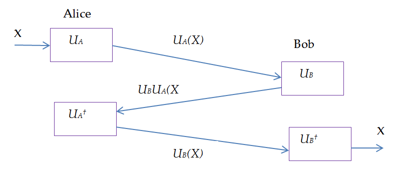

### Second-order correlation $g^{(2)}$ (Lecture 10)

This is defined as the correlation between the number of photons you find at some time $t$ and the number of photons you find at some time $t + \tau$:

$$
g^{(2)}(\tau) = \frac{\braket{ n(t) \cdot n(t + \tau)} }{\braket{n(t)} \cdot  \braket{ n(t + \tau)}}
$$

aka the relative likelihood that if I see photon at some time, then $\tau$ seconds later, I'll see another photon. (You might also see it in terms of intensity instead of number of photons, but it's the same thing.)

$$
\frac{1}{\tau} \int_{0}^{\tau} n(t) \cdot n(t + \tau) dt
$$

Now we have three classifications of light based on the value of this function at $\tau = 0$, which is the probability of detecting two photons at the same time.

1. Bunched light: $g^{(2)}(0) > 1$ 
2. Random light. $g^{(2)}(0) = 1$
3. Anti-bunched light. $g^{(2)}(0) < 1$  (Only possible quantum mechanically.)

So if we model our photon numbers as:

$$
n(t) = \bar{n} + \Delta n(t)
$$

our second-order correlation function is:

$$
\begin{align*} 
g^{(2)}(\tau) 
&= \frac{\braket{ \Delta n(t) \cdot \Delta n(t + \tau)} }{\braket{\Delta n(t)} \cdot  \braket{ \Delta n(t + \tau)}} \\
&= \frac{\braket{\bar{n}^2 + \bar{n} \Delta n(t) + \bar{n} \Delta n(t + \tau) + \Delta n(t) \Delta n(t + \tau)}}{\bar{n}^2} \\
&= \frac{\bar{n}^2 + \braket{\Delta n(t) \Delta n(t + \tau)}}{\bar{n}^2} \\
\end{align*}
$$

Because the delta should be zero on average, and the E.V of the average is the average.

So the sign of the $\braket{\Delta n(t) \Delta n(t + \tau)}$ term determines whether the light is random, bunched, or anti-bunched.

### Entanglement schemes for QKD

### E91 Protocol
A bunch of entangled photons are generated. Alice and Bob each end up with one photon from each pair. 

There are two sets of measurement bases for Alice and Bob:

$$
\Phi_{A} = \{-45\degree, 0\degree, 45\degree \}
\, \\
\Phi_{B} = \{0\degree, 45\degree, 90\degree \}
$$

The stages of the protocol are:
1. Alice and Bob both randomly choose a basis for their photon from their respective sets.
   
2. They measure their photon in that basis.
   
3. They publish the bases they chose for each photon.
4. The divide the measurement results into two sets: one is the _decoy qubits_ $G_1$ where they choose different measurement basis and another is the _raw key qubits_ $G_2$ where they choose the same measurement basis.
   
5. $G_1$ is used to detect whether there is an eavesdropping. For that, they can compute the test statistic $S$ using the correlation coefficients between Alice’s bases and Bob’s. Basically doing a Bell test.
   
6. If the Bell test doesn't detect an eavesdropper, then they can use the raw key qubits $G_2$ to generate a key.

### Kak's Three-stage quantum key distribution protocol

Where $X = \ket{\psi}$, we can use any of the Pauli rotation gates for our $U_A$ and $U_B$ gates, the only point is that they have to be the same for Alice and Bob, and Alice and Bob have their own private rotation angles.

### Remote Entanglement

[Bunch of practical stuff, using photons to entangle two distant atoms. i.e. Entangling atoms to photons, then interacting the photons and letting them collapse so that the atoms then become entangled.]

