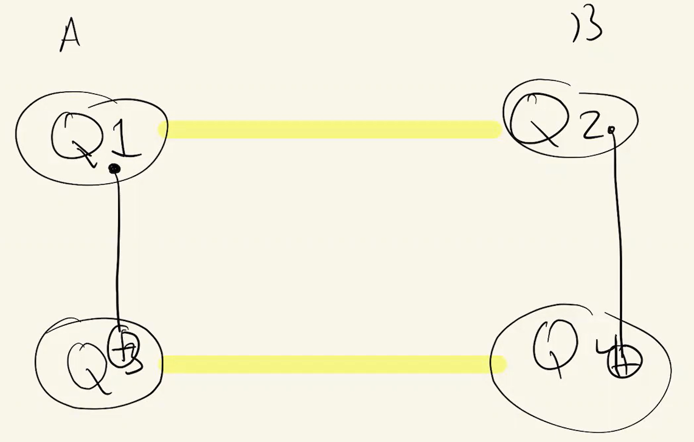
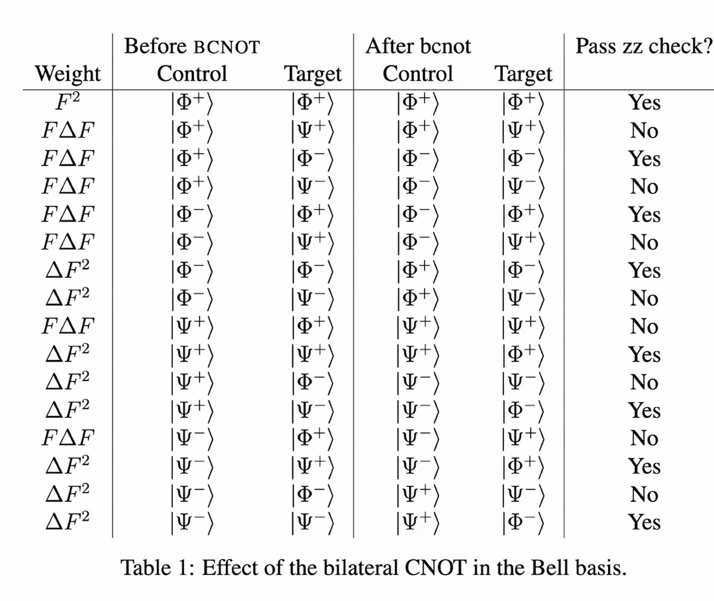
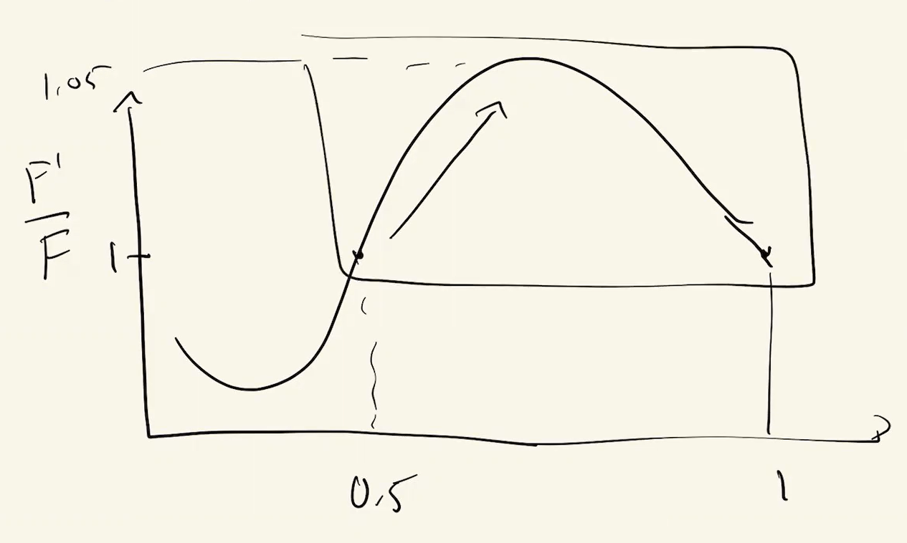

# Lecture 11

### No-Signaling Theorem

Entangled pairs can't be used to transmit information faster than the speed of light.

We can write our initial bipartite pure state (no matter entangled or not) as: 

$$
\rho_0 = \sum_{i,j} p_{ij} \underbrace{\ket{a_i} \bra{a_i}}_{Alice} \otimes \underbrace{\ket{b_j} \bra{b_j}}_{Bob}
$$

Now that assume Alice does some operation (unitary, measurement, anything) of her part of the state, defined by a set of Kraus operators $K_k$, we get:

$$
\begin{align*} 
\rho_1 
&= \sum_{k} (K_k \otimes I_B) \rho_0 (K_k \otimes I_B)^{\dagger} \\
&= \sum_{k, i, j} p_{ij} K_k \ket{a_i} \bra{a_i} K_k^{\dagger} \otimes \ket{b_j} \bra{b_j} \\
\end{align*}
$$

Now, Bob can only see the state of his part of the system, so he can't know what Alice did. So his information about the state comes from tracing out Alice's part of the state:

$$
\begin{align*}
\rho_B
&= Tr_A(\rho_1) \\
&= \sum_m \bra{a_m} \Big( \sum_{k, i, j} p_{ij} K_k \ket{a_i} \bra{a_i} K_k^{\dagger} \Big) \ket{a_m} \otimes \ket{b_j} \bra{b_j} \\
&= \sum_m \sum_{k, i, j} p_{ij} \Big( \underbrace{\bra{a_m} K_k \ket{a_i}}_{scalar} \cdot  \underbrace{\bra{a_i} K_k^{\dagger} \ket{a_m}}_{scalar} \Big) \otimes \ket{b_j} \bra{b_j} \\
&= \underbrace{\sum_m} \sum_{k, i, j} p_{ij} \Big( \bra{a_i} K_k^{\dagger} \underbrace{\ket{a_m} \bra{a_m}}_{I} K_k \ket{a_i}  \Big) \otimes \ket{b_j} \bra{b_j} \\
&= \underbrace{\sum_{k}} \sum_{i, j} p_{ij} \Big( \bra{a_i} \underbrace{K_k^{\dagger} K_k}_{I} \ket{a_i}  \Big) \otimes \ket{b_j} \bra{b_j} \\
&= \underbrace{\sum_{i}} \sum_j p_{ij} \underbrace{\braket{a_i | a_i}}_{1} \otimes \ket{b_j} \bra{b_j} \\
&= \sum_j p_{ij} \ket{b_j} \bra{b_j} \\
\end{align*}
$$

Now, we can see that this equation would be true, no matter what Alice's Kraus operators where. They could've even been $I_{A}$ and Bob's information of the state still would've been the same.

### Communication over a noisy channel

Imagine we have a noisy quantum channel from Alice to Bob, then the errors that could happen are:

1. Photon loss. 
   Bob declares whether or not he got in click in his detector at each time $t$, if Alice had sent one at that time and Bob didn't get a click, then they just discard that time step.
2. Bit flip errors.
    This can be ameliorated by using classical error correction methods such as parity checks after measuring the qubits. \
    From Shannon's noisy channel coding theorem, we know that we if we want to send $N$ bits of information over a noisy channel with a bit error rate of $p$, then we need to send an $N_{extra}$ extra number of bits:
    $$
    N_{extra} = -N \Big( p \log_2 p + (1-p) \log_2 (1-p) \Big)
    $$

3. [Rest was skipped in lecture lol]

### Entanglement Purification / Distillation

Suppose Alice and Bob have $n$ noisy copies of an entangled state, and they want to turn it into $n$ copies of a pure entangled state.

There are multiple methods of doing this, but the one we discuss here is by Charlie Bennett et. al. in 1996. [arXiv](https://arxiv.org/abs/quant-ph/9604024).

Before we dive deep into this protocol, let us be reminded of the fact that the $4$ bell-states we have for $2$ qubits construct a complete basis for their Hilbert space. This means that any state can be written as a linear combination of these states.

As a reminder, those $4$ states are:
$$
\ket{\Phi^{\pm}} = \frac{1}{\sqrt{2}} \Big( \ket{00} \pm \ket{11} \Big) \\
\, \\
\ket{\Psi^{\pm}} = \frac{1}{\sqrt{2}} \Big( \ket{01} \pm \ket{10} \Big)
$$

Now for this protocol, we assume that the state Alice wants to send is the $\ket{\Psi^-}$ state. So if Alice sends $1$ copy of the density matrix 
$$
\rho_A = \ket{\Psi^-} \bra{\Psi^-}
$$ 
to Bob, but as the channel is noisy, Bob receives the following density matrix:

- Step 0

$$
\ket{\psi} = a \ket{\Phi^+} + b \ket{\Phi^-} + c \ket{\Psi^+} + \sqrt{F} \ket{\Psi^-}
$$

Meaning that Bob receives $\rho_{out} = \ket{\psi} \bra{\psi}$.

Where $F$ is our fidelity, because as we remember, Fidelity of a channel was defined as:

$$
F = |\braket{\psi_{input} | \psi_{output}}|^2
$$

- Step 1

Now, the protocol says that we have a set of bilateral (meaning that is applied on both) rotations of the form:

$$
B_{P} = R_{P}^{(A)}(\theta = \frac{\pi}{2}) \otimes R_{P}^{(B)}(\theta = \frac{\pi}{2}) \\
\, \\
I = I^{(A)} \otimes I^{(B)}
$$

Where $P \in \{X, Y, Z\}$. (All Pauli rotations)

So our set of rotations is $U_i \in \{B_X, B_Y, B_Z\, I \}$. We're going to randomly choose from this set of rotations, and apply them to all $n$ of Alice and Bob's qubits.

Now the reason for this is that $\ket{\Psi^{-}}$ is the singlet state, meaning that it has a total spin of $0$. So if we apply a Pauli rotation to it, it will remain in the singlet state. (i.e.  the singlet state is invariant under unitary transformations.)

So our Kraus map becomes the map that is constructed by each of the operators having $\sqrt{p} = \sqrt{\frac{1}{4}}$ probability of being chosen. \ 
So the output state of this Kraus map applied to our noisy states is:

$$
\begin{align*} 
\rho^{(1)}_{out} 
&= \frac{1}{4} \sum_{i=1}^{4} U_i \rho_{out} U^{\dagger}_{i} \\
&= |a|^2 \ket{\Phi^{+}}\bra{\Phi^{+}} + |b|^2 \ket{\Phi^{-}}\bra{\Phi^{-}} \\
&+ |c|^2 \ket{\Psi^{+}}\bra{\Psi^{+}} + F \ket{\Psi^{-}}\bra{\Psi^{-}}
\end{align*}
$$

Where the derivation has been skipped (which you can see in the appendix of the paper mentioned above).
 
- Step 3

Now, we restrict our bilateral rotations to $U_j \in \{B_X, B_Y, B_Z \}$ and apply the Kraus map again. This time, we get:

$$
\begin{align*} 
\rho^{(2)}_{out}
&= \sum_{i=1}^{3} U_i \rho^{(1)}_{out} U^{\dagger}_{i} \\
&= \frac{1 - F}{3} \ket{\Phi^{+}}\bra{\Phi^{+}} + \frac{1 - F}{3} \ket{\Phi^{-}}\bra{\Phi^{-}} \\
&+ \frac{1 - F}{3} \ket{\Psi^{+}}\bra{\Psi^{+}} + F \ket{\Psi^{-}}\bra{\Psi^{-}}
\end{align*}
$$

The point of this rotation is to symmetrize the state. This state is also sometimes called the _Werner state_ and denoted by $W_F$ where $F$ is again the fidelity of the channel.

So we have the same probability of getting any of the "other" Bell states and the total probability of getting a wrong state is $1 - F$.

- Step 4

Now Bob applies a $\sigma_y$ matrix to his qubit. Note that he doesn't have access to Alice's qubit. Applying this matrix to our $4$ bell states gives us:

$$
\begin{align*}
\sigma_y^{(B)} \ket{\Phi^{+}} & = i \ket{\Psi^{-}} \\
\sigma_y^{(B)} \ket{\Phi^{-}} & = i \ket{\Psi^{+}} \\
\sigma_y^{(B)} \ket{\Psi^{+}} & = -i \ket{\Phi^{-}} \\
\sigma_y^{(B)} \ket{\Psi^{-}} & = -i \ket{\Phi^{+}}
\end{align*}
$$

Applying this to our previous state gives us:

$$
\begin{align*} 
\rho^{(3)}_{out} 
&= \sigma_y^{(B)} \rho^{(2)}_{out} \sigma_y^{\dagger (B)} \\
&= F \ket{\Phi^{+}}\bra{\Phi^{+}} + \frac{1 - F}{3} \ket{\Phi^{-}}\bra{\Phi^{-}} \\
&+ \frac{1 - F}{3} \ket{\Psi^{+}}\bra{\Psi^{+}} + \frac{1 - F}{3} \ket{\Psi^{-}}\bra{\Psi^{-}}
\end{align*}
$$

Then we would like to apply something called a Bilateral CNOT, which is done on $2$ pairs of noisy entangled qubits that are shared between Alice and Bob. Each one of them uses one of their own qubits as the control qubit and the other one as the target qubit.

Which means that:

$$
CNOT = CNOT_{1, 3} \otimes CNOT_{2, 4}
$$

Now we can see how this works on our basis states. Not that because here we're working with **two** pairs of entangled qubits, each of which could be in any of the $4$ bell states, so we have $16$ different combinations that we should consider, so we will only show the first one:

$$
\begin{align*}
BCNOT \ket{\Phi^{+}_1} \otimes \ket{\Phi^{+}_2} 
&= CNOT_{1, 3} \otimes CNOT_{2, 4} \cdot \Big( \ket{0000} + \ket{0011} + \ket{1100} + \ket{1111} \Big) \\
&= \ket{0000} + \ket{0011} + \ket{1100} + \ket{1111} \\
&= \ket{\Phi^{+}_1} \otimes \ket{\Phi^{+}_2}
\end{align*}
$$

To avoid any headache, we will use this following table to keep track of the states of the qubits after $BCNOT$:

And our state becomes:

$$
\rho^{(4)}_{out} = BCNOT \cdot \rho^{(3)}_{out} \cdot BCNOT^{\dagger}
$$

After applying $BCNOT$ to our state, both of them measure their *target* qubits in the $Z$ basis. \ 
If the target states are in the same state, we say they pass the $zz$ check. You'll see that only the $\ket{\Phi}$ states pass this, as in the $\ket{\Psi}$ qubits are anti-correlated. \
If they don't pass the $zz$ check, we discard the control qubits as well.

Assuming they've passed the check, we want to see what's the probability of our control state being in the $\ket{\Phi^{+}}$ state after the $BCNOT$.

We see that only row $1$ and $7$ of our table have this condition, so we have to divide their weight over the total weight of the states that pass the $zz$ test to get the probability. (Because the others have been discarded!)

Re-writing $\Delta F = \frac{1-F}{3}$, we get:

$$
\begin{align*} 
F^{\prime} 
&= P(\ket{\Phi^{+}})  \\
&= \frac{F^2 + (\Delta F)^2}{F^2 + 5 \Delta F + 2 F \Delta F} \\
\, \\
&= \frac{F^2 + \frac{1}{9} (1-F)^2}{F^2 + \frac{2}{3} F (1-F) + \frac{5}{9} (1-F)^2} \\
\end{align*}
$$

Now, if $F^{\prime} > F$, we can say that entangelement has been purified. Let's plot this:

We see that if $F>0.5$, we can purify the entanglement by applying this protocol multiple times.
The maximum we can do in one run is a $5\%$ improvement, which is not that much. But if we apply this protocol multiple times, we can get a much better improvement.

### Distillable Entanglement

The question is: Given $n$ copies of (possibly) entangled qubits, how many Bell states ($m$) can we prepare?

Which means that Distillable Entanglement is the following ratio:

$$
D(\rho) = \frac{m}{n}
$$

Now in Nielsen and Chuang's book, they say that the distillable entanglement of a pure state is the entanglement entropy of the state. (Section 12.5.2)

$$
D(\rho) = D(\ket{\psi}) = S(\ket{\psi}\bra{\psi})
$$

We can easily see that if $\rho$ was actually a Bell state, then $D(\rho) = 1$ because we can distill $1$ Bell state from $1$ pair of entangled qubits. (The entanglement entropy of a Bell state is $1$)

For mixed states, it's much more complicated.
