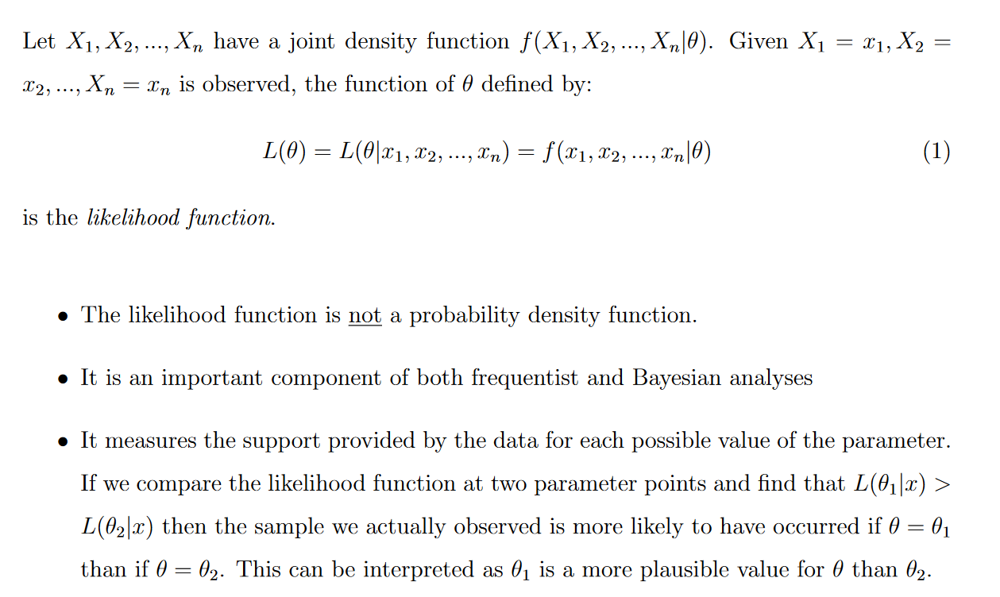
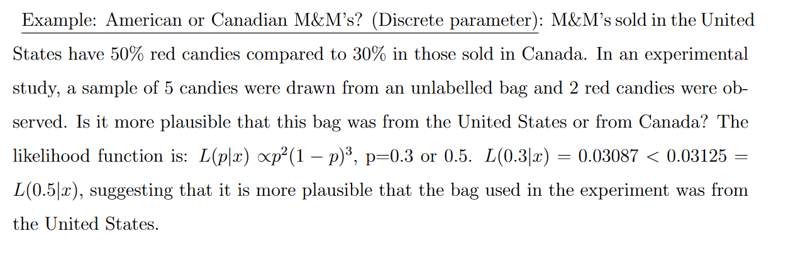

# Lecture 13

## Probability and Stats

### Likelihood 

If our samples are _iid_, then we can multiply the probabilities together to get the joint likelihood.

$$
\mathcal{L}(\theta) = \prod_{i=1}^{n} P(x_i | \theta)
$$

### Maximum Likelihood Estimation (MLE)

This is the process of trying to find the optimal parameter $\theta_{\mathcal{L}}$ that maximizes the likelihood function, via setting the derivative of the likelihood function to $0$:

$$
\frac{\partial \mathcal{L}}{\partial \theta_i} = 0
$$

Keep in mind that $\theta$ is a vector of parameters, so we have to do this for each parameter.

### Log Likelihood

To turn the multiplication into a sum, we take the log of the likelihood function. For example, if we have a Gaussian process, $\theta = \{\mu, \sigma\}$, then the likelihood function is:

$$
\begin{align*}
\mathcal{L}(\theta)
&= \prod_{i=1}^{n} P(x_i | \theta) \\
&= \prod_{i=1}^{n} \frac{1}{\sqrt{2 \pi \sigma^2}} \exp \Big( -\frac{(x_i - \mu)^2}{2 \sigma^2} \Big) \\
\, \\
\Rightarrow \ln(\mathcal{L}(\theta)) 
&= \sum_{i=1}^{n} \Big( \ln(\frac{1}{\sqrt{2\pi \sigma^2}}) - (\frac{(x - \mu)^2}{2 \sigma^2}) \Big)\\
\end{align*}
$$

The maximum of a function also happens when the maximum of its log function happens. So we can just take the log of the likelihood function and maximize that instead.

In our Gaussian example, we see that:

$$
\begin{align*}
\frac{\partial \ln(\mathcal{L}(\theta))}{\partial \mu} 
&= \sum_{i=1}^{N} \frac{x_i - \mu}{\sigma^2} = 0 \\
\, \\
\Rightarrow \sum_{i=1}^{N} x_i - \sum_{i=1}^{N} \mu 
&= 0 \\
\, \\
\Rightarrow \mu_e = \frac{1}{N} \sum_{i=1}^{N} x_i &= \bar{x}
\end{align*}
$$

So our estimated mean $\mu_e$ is just the average of our samples.

And for the variance (omitting the derivation), the estimated variance is:

$$
\sigma_{e} = \frac{1}{N} \sum_{i=1}^{N} (x_i - \mu_e)^2
$$

Because from our experiment, we don't know the true value of $\mu$, so we use the estimated value $\mu_e$ instead.

### Bias of an estimators

The bias of an estimator (or bias function) is the difference between this estimator's expected value and the true value of the parameter being estimated. An estimator or decision rule with zero bias is called unbiased.

$$
Bias = E(\theta_e) - \theta
$$

This expectation value comes from us doing many different experiments and averaging the results:

$$
\vec{X_1} = \{x_1, x_2, \dots, x_n\} \mapsto \theta_e^{(1)} \\
\, \\
\vec{X_2} = \{x_1, x_2, \dots, x_n\} \mapsto \theta_e^{(2)} \\
\vdots \\
\vec{X_N} = \{x_1, x_2, \dots, x_n\} \mapsto \theta_e^{(N)}
$$

Then we average the results:

$$
\theta_e = \frac{1}{N} \sum_{i=1}^{N} \theta_e^{(i)}
$$

This means that the sample mean of an estimator is:

$$
\bar{x} = \frac{1}{N} \sum_{i=1}^{N} x_i
$$

And the sample variance of an estimator is:

$$
S^2 = \frac{1}{N} \sum_{i=1}^{N} (x_i - \bar{x})^2
$$

But the sample variance is biased! (As you'll see) \
So we have to correct it:

$$
\begin{align*} 
\mathbb{E}(S^2) &= \dots \\
&= \mathbb{E} \Big[ \frac{1}{N} \sum_{i=1}^{N} (x_i - \mu)^2 \Big] - \mathbb{E} \Big[ (\bar{x} - \mu)^2 \Big] \\
&= \sigma^2 - \mathbb{E} \Big[ (\bar{x} - \mu)^2 \Big] \\
&= (1 - \frac{1}{N}) \sigma^2 < \sigma^2 \\
\end{align*}
$$

As we can see, the bias is: $-\frac{1}{N} \sigma^2$

The correction is:

$$
S^2 = \frac{1}{N - 1} \sum_{i=1}^{N} (x_i - \bar{x})^2
$$

Which results in:

$$
\mathbb{E}(S^2) = \sigma^2
$$