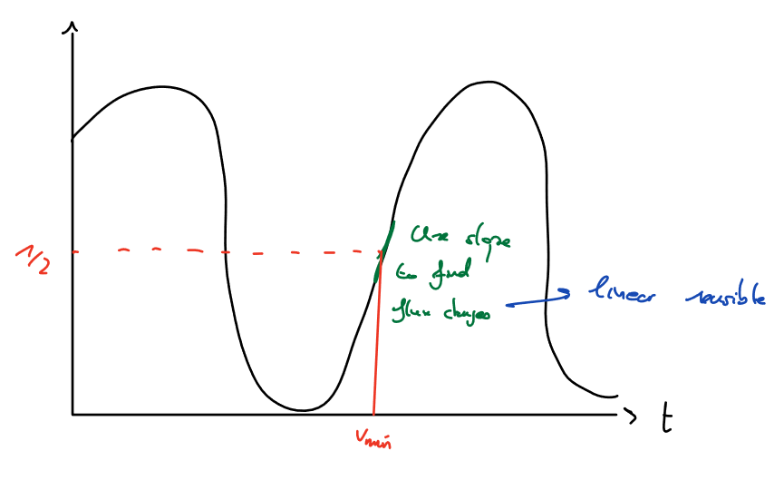
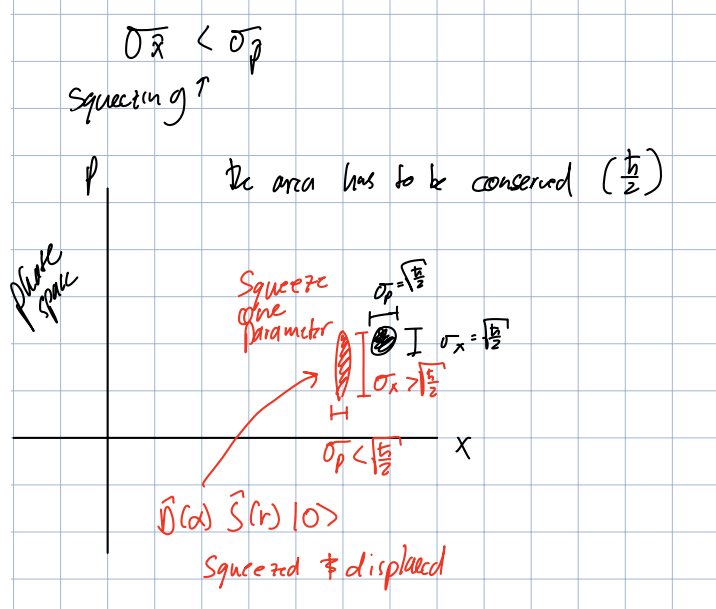

# Lecture 15

## Model Testing 

Denoting the number of free parameters as $v$, we can use the $\chi^2$ test to determine if our model is a good fit for the data.

$$
\frac{\chi^2}{v} \approx 1
$$

The closer this value is to $1$, the better the fit.

---

## Quantum Sensing 1.1 

We try to measure fields using a quantum state in the form:

$$
\ket{\psi} = \frac{1}{\sqrt{2}} \big( \ket{0} + e^{i \phi(t)} \ket{1} \big)
$$

The ways of using this system are:

1. Measuring $\phi(t) = \frac{E_0 - E_1}{\hbar} t \rightarrow$ Measure $\Delta E$.
2. EM fields change the phase of the state $\rightarrow$ Measure $\phi(t)$. (Difference between 1 and 2 is the size of the field)
3. Assume $\Delta E$ is fixed $\rightarrow$ build a clock.

### Slope detection (Ramsey)

(All of this is done using an esnemble of qubits)

1. Prepare $\ket{0}$.
   
2. Apply a $\frac{\pi}{2}$ pulse. 
   $$\ket{\psi} = \frac{1}{\sqrt{2}} \big( \ket{0} + \ket{1} \big)$$

3. Allow state to evolve for time $t$: 
   $$\ket{\psi} = \frac{1}{\sqrt{2}} \big( \ket{0} + e^{-i \delta t} \ket{1} \big)$$
   Where $\delta = \frac{E_0 - E_1}{\hbar}$.

4. Apply a $\frac{\pi}{2}$ pulse again. 
   $$\ket{\psi} = e^{\frac{-i \delta t}{\hbar}} \big( \sin(\frac{\delta t}{2}) \ket{0} + \cos(\frac{\delta t}{2})  \ket{1} \big)$$

5. Measure this the number of states in $\ket{1}$.
    $$
    D_1 = \frac{N_{\ket{1}}}{N}
    $$

Run these steps multiple times to obtain an average value, then we can determine the slope of the phase by doing an inverse cosine of the average value.

### Sensitivity 

As our sensing state is:
$$\ket{\psi} = e^{\frac{-i \delta t}{\hbar}} \big( \sin(\frac{\delta t}{2}) \ket{0} + \cos(\frac{\delta t}{2})  \ket{1} \big)$$

We want to be half-way through the Ramsey pulse so we could approximate the change of the phase as a linear function of time.

So, we want $\cos^2(\frac{\delta t}{2}) = \frac{1}{2}$ , so that $\frac{\delta t}{2} = \frac{\pi}{4} \rightarrow \delta = \frac{\pi}{2t}$

Because we can't be exact, we do the linear approximation and say that the $\delta$ we get is a linear function of time:

$$
\begin{align*} 
\delta^{\prime} 
&= \frac{\pi}{2t} + \underbrace{2 \gamma \phi}_{\Delta \delta} \\
\, \\
\Rightarrow P_1 
&= \cos^{2}(\frac{\delta^{\prime} t}{2}) \\ 
&= \cos^{2}(\frac{\delta + \Delta \delta t}{2}) \\
&\stackrel{linear}{\approx} \frac{1}{2} + \frac{\Delta \delta t}{2} \\
\, \\
\Rightarrow \delta P_1 &= \frac{\Delta \delta t}{2} = \gamma \phi t \\
\, \\
\Rightarrow \phi = \frac{\delta p_1}{\gamma t}
\end{align*}
$$

What this means it that the applied field change the phase of our qubit's state $\Rightarrow$ $P_1$ gets shifted from $\frac{1}{2}$.

Note that Slope detection is limited to the linear range.

Our achieveable sensitivity for $\phi$ in slope detection is:

$$
\begin{align*} 
\phi_{min} &= \frac{\sigma_{p_1}}{\gamma t} \\
\, \\
\sigma_{p_1} &= \frac{\sigma_{N_1}}{N} \\
\, \\
\sigma_{N_1} &= \sqrt{N p (1-p)} \approx \frac{\sqrt{N}}{2}
\end{align*}
$$

Where the $\sigma_{N_1}$ is the Quantum Projection Noise (QPN), which is non-zero even when $N=1$.

Which gets us to:

$$
\phi_{min}^{slope} = \frac{1}{2 \gamma t \sqrt{N}}
$$

This is called the **Standard Quantum Limit**.

We see that our sensitivity only gets better with the square root of the number of experiments we do. And the $t$ factor in the denominator is the bounded by the $T_2$, the decoherence time.

We could measure faster (before it decoheres), but it will come with a loss of accuracy.

### Variance detection (Ramsey) (Lecture 16)

As opposed to the slope detection method, here we try to detect the signal at the top/bottom of the Ramsey curve, which means doing a full $\pi$ pulse instead of a $\frac{\pi}{2}$ pulse.

Therefore,

$$
P_1 = \cos^2(\frac{\delta t}{2}) = \cos^2(\frac{\pi}{2} + \frac{2 \gamma \phi t}{2})
$$

Doing yet another Taylor expansion, we get:

$$
\delta p_1 = (\gamma \phi t)^2 \\ 
\, \\
\Rightarrow \phi^{variance} = \frac{\sqrt{p_1}}{\gamma t}
\, \\
\Rightarrow \phi^{variance}_{min} = \frac{\sqrt{\sigma_{p_1}}}{\gamma t}
$$

But here, the Quantum Projection Noise is $0$.

---

## Quantum Sensing 2.0

### Quantum Harmonic Oscillator Sensing

## Squeezed States

The point of making a squeezed state is that we want to play with the uncertainty of the position and momentum of the oscillator. 

Note that the uncertainty in position and momentum is going to oscillate with time.

Previously, for a Driven QHO, we had:

$$
F = -F_0 \sin(\omega t + \phi) \\
$$

Which meant:

$$
\begin{align*} 
V_1
&= F_0 \hat{x} \sin(\omega t + \phi) \\
&= F_0 (\hat{a} + \hat{a}^{\dagger}) \sin(\omega t + \phi)
\end{align*}
$$

Exponentiating this would result in the Displacement operator:

$$
\hat{D}(\alpha) = e^{\alpha \hat{a}^{\dagger} - \alpha^{\dagger} \hat{a}}
$$

Where

$$
\alpha = \frac{f_0 t}{\hbar} e^{-i \phi}
$$

Now, we want to apply a drive that's $0$ at the center, and it gets stronger as we move away from the center. (quadtratic!)

$$
V_2 = \frac{1}{2} F_0 \hat{x}^2 \sin(\omega t + \phi)
$$

Exponentiating this gives rise to the Squeezing operator:

$$
\hat{S}(r) = e^{r^{*} \hat{a}^{\dagger 2} - r \hat{a}^2}
$$

Where

$$
r = \frac{F_0 t}{4 m \omega \hbar} e^{-i \phi}
$$