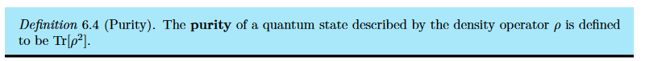
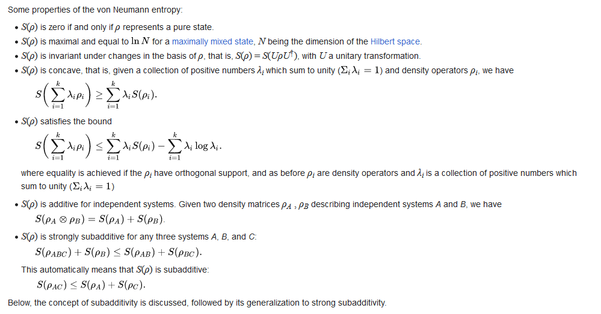
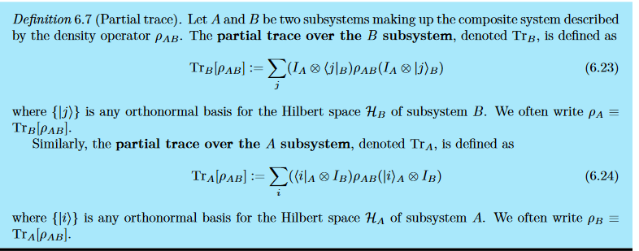

# Lecture 2

## Quantum Measures

If the system is finite (finite-dimensional matrix representation), the entropy S(ρ) quantifies the departure of the system from a pure state

Also see this [document](https://documents.epfl.ch/groups/i/ip/ipg/www/2011-2012/Quantum_Information_Theory_and_Computation/lect6quantinfo1112.pdf)

Also see this [document](https://www.ryanlarose.com/uploads/1/1/5/8/115879647/quic06-states-trace.pdf) as well.

### von Neumann Entropy

### Entanglement Entropy

---

## Lindblad Master Equation

[For a pedagogical introduction to the Lindblad Master Equation, see this [arXiv](https://arxiv.org/abs/1906.04478)]

The Lindbladian of a system's density matrix $\rho$ can be written as:

$$
\dot{\rho} = \frac{-i}{\hbar}[H, \rho] + \sum_{i} \gamma_{i} \Big( L_i \rho L_i^{\dagger} - \frac{1}{2} \{ L_i^{\dagger} L_i, \rho \} \Big)
$$

Also written as:

$$
\begin{align*}
i \hbar \frac{\partial \rho}{\partial t} &= [H, \rho] + \sum_{i > 0} L_i \rho L_i^{\dagger} - \frac{1}{2} (\sum_{i>0} L_i^{\dagger} L_i \rho + \rho \sum_{i>0} L_i^{\dagger} L_i) \\
&= [H, \rho] + \mathcal{L}(\rho)
\end{align*}
$$

Where the $L_i$ are the Lindblad operators, and they could be either unitary or non-unitary. \
$L_i$ are a set of jump operators describing the dissipative part of the dynamics. The shape of the jump operators describes how the environment acts on the system, and must ultimately be determined from microscopic models of the system-environment dynamics. \
Finally, $\gamma_{i}\geq 0$ are a set of non-negative coefficients called damping rates. If all $\gamma_i = 0$ one recovers the von Neumann equation $\dot {\rho } = -\frac{i}{\hbar}[H,\rho]$ describing unitary dynamics.