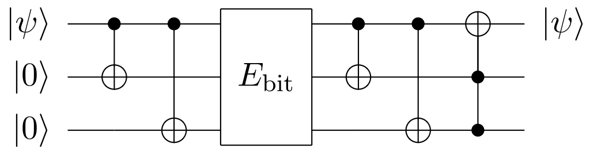
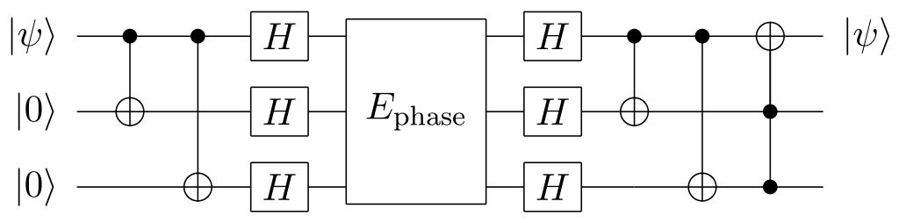
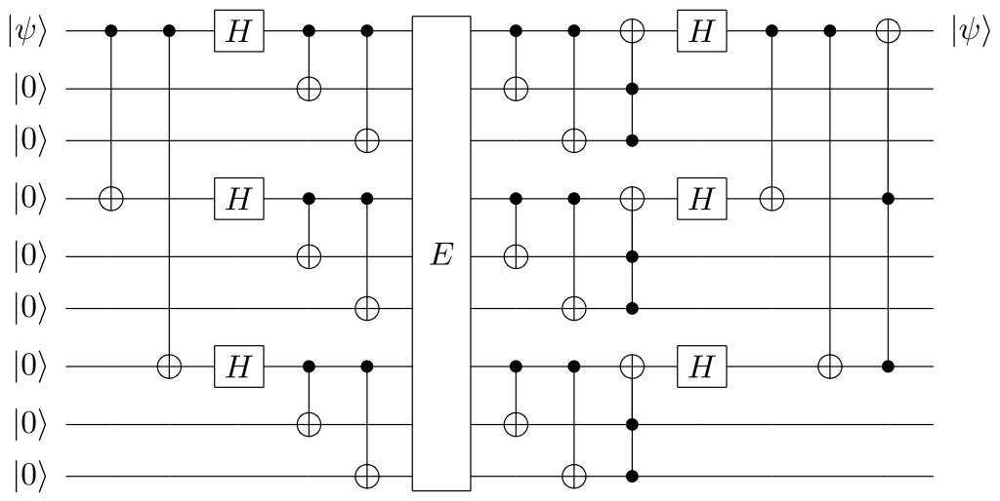

# Lecture 5

## Quantum Error Correction

### Bit Flip error

$$
\ket{0} \mapsto \ket{0}_L \equiv \ket{000} \\
\ket{1} \mapsto \ket{1}_L \equiv \ket{111}
$$

### Phase Flip error

$$
\ket{0} \mapsto \ket{+++} \\
\ket{1} \mapsto \ket{---}
$$

### Shor's Code

$$
\ket{0} \mapsto (\ket{000} + \ket{111}) \otimes (\ket{000} + \ket{111}) \otimes (\ket{000} + \ket{111}) \\
\ket{1} \mapsto (\ket{000} - \ket{111}) \otimes (\ket{000} - \ket{111}) \otimes (\ket{000} - \ket{111})
$$